# Audit record: rf-frontend (hardware revision A)

Generated 2026-10-01T05:37:45+00:00 by Anvil from the project's own evidence. Release kind `pcb`, target gate `G3`, sectors ['industrial'], markets ['US', 'EU'], features ['electronics'].

**Gate result: `G3_BLOCKED`** with 42 blocker(s).

- HW-001: HW-001: missing or not_run
- HW-002: HW-002: missing or not_run
- HW-003: HW-003: missing or not_run
- HW-004: HW-004: missing or not_run
- HW-005: HW-005: missing or not_run
- HW-006: HW-006: missing or not_run
- HW-007: HW-007: missing or not_run
- HW-008: HW-008: missing or not_run
- HW-009: HW-009: missing or not_run
- HW-010: HW-010: missing or not_run
- HW-011: HW-011: missing or not_run
- HW-012: HW-012: missing or not_run
- HW-013: HW-013: missing or not_run
- HW-014: HW-014: missing or not_run
- HW-015: HW-015: missing or not_run
- HW-016: HW-016: missing or not_run
- HW-017: HW-017: missing or not_run
- HW-018: HW-018: missing or not_run
- HW-019: HW-019: missing or not_run
- HW-020: HW-020: missing or not_run
- HW-048: HW-048: missing or not_run
- HW-049: HW-049: missing or not_run
- HW-055: HW-055: missing or not_run
- HW-056-PLAN: HW-056-PLAN: missing or not_run
- HW-057-PLAN: HW-057-PLAN: missing or not_run
- HW-062-PLAN: HW-062-PLAN: missing or not_run
- HW-063-PLAN: HW-063-PLAN: missing or not_run
- HW-064-PLAN: HW-064-PLAN: missing or not_run
- HW-065-PLAN: HW-065-PLAN: missing or not_run
- HW-066-PLAN: HW-066-PLAN: missing or not_run
- HW-073-PLAN: HW-073-PLAN: missing or not_run
- AUTO-EM: AUTO-EM: missing or not_run
- REQ-HR-001: REQ-HR-001: missing or not_run
- REQ-HR-002: REQ-HR-002: missing or not_run
- REQ-HR-003: REQ-HR-003: missing or not_run
- REQ-HR-004: REQ-HR-004: missing or not_run
- REQ-HR-005: REQ-HR-005: missing or not_run
- REQ-HR-006: REQ-HR-006: missing or not_run
- REQ-HR-007: REQ-HR-007: missing or not_run
- REQ-HR-008: REQ-HR-008: missing or not_run
- REQ-HR-009: REQ-HR-009: missing or not_run
- REQ-HR-010: REQ-HR-010: missing or not_run

This document quotes receipts and transcripts; it does not itself authorize release.

## 1. Requirements

| id | statement | units | conditions | method | gate | owner |
|---|---|---|---|---|---|---|
| HR-001 | RF input and output networks: return loss >= 15 dB and insertion loss <= 0.6 dB from 2.3 to 2.5 GHz (connector landing to gain-block pin) | dB | full-wave model of the released copper, 50 ohm ports | simulation | G3 | RF engineering |
| HR-002 | Every RF line 50 ohm +/-10 % on the fabricator stackup | ohm | field solution of the routed cross-section incl. mask and coplanar gaps | analysis | G3 | RF engineering |
| HR-003 | Gain-block bias current 100 mA +/-10 % from the 12 V input (device voltage 4.4 V typ, datasheet value to confirm) | mA | 12 V +/-10 % input, 25 C | analysis | G3 | RF engineering |
| HR-004 | Every resistor at or below 50 % of its rated power (2x derating) | % | worst-case 13.2 V input, 70 C ambient rating | analysis | G3 | Reliability |
| HR-005 | 25 MHz clock into a 50 ohm load: overshoot <= 15 %, ringback <= 20 %, settled within 5 ns | % | routed clock net, 1 ns edges | simulation | G3 | Digital engineering |
| HR-006 | +3V3 rail impedance at the oscillator below Z_target (2 % ripple on a 20 mA step) from 1 kHz to 100 MHz | ohm | released capacitor set and planes | analysis | G3 | Power engineering |
| HR-007 | Every dissipating part at least 20 C below its maximum junction/element temperature | C | 40 C still air, board horizontal | analysis | G3 | Thermal engineering |
| HR-008 | Clock-harmonic radiated-emission estimate at least 6 dB below CISPR 32 Class B (estimate only; chamber test at EVT) | dB | routed clock loops, 10 m limit line | analysis | G3 | EMC engineering |
| HR-009 | 12 V input path: trace temperature rise <= 10 C at 150 mA | C | IPC-2152 external/internal fits | analysis | G3 | Power engineering |
| HR-010 | Schematic connectivity equals the golden circuit description | nets | fresh KiCad netlist export | inspection | G3 | Electrical engineering |
| HR-011 | Assembled board: measured S11 <= -10 dB from 2.3 to 2.5 GHz at both RF ports | dB | VNA, calibrated at the SMA reference planes | test | G4 | RF engineering |

## 2. Research and sources consulted

| id | timestamp | kind | source | locator | claim | used_for | rules |
|---|---|---|---|---|---|---|---|
| SRC-1 | 2026-09-30T08:13:13+00:00 | book | bowick2008 | rulebook BOWICK | RF chain topology: DC blocks, bias tee, choke reactance | architecture | BOWICK-023 |
| SRC-2 | 2026-09-30T08:13:13+00:00 | book | horowitz2015 | AOE-3330 | choke reactance above line impedance at all operating frequencies; DC block sized for the lowest frequency | L1/C1/C2 sizing | AOE-3330 |
| SRC-3 | 2026-09-30T08:13:13+00:00 | book | wilson2011 | WILSON-394 | derate resistor power by at least 2x | bias resistor rating | WILSON-394 |
| SRC-4 | 2026-09-30T08:13:14+00:00 | book | archambeault2002 | ARCH-065, ARCH-067 | fence vias <= lambda/10; MLCC ESL/ESR by dielectric and package | via fence, PDN | ARCH-065;ARCH-067 |
| SRC-5 | 2026-09-30T08:13:14+00:00 | book | williams2016 | WILLIAMS-2038 | ground conductors shorter than lambda/20 stay below resonance | pour stitching | WILLIAMS-2038 |
| SRC-6 | 2026-09-30T08:13:14+00:00 | book | bogatin2018 | BOGATIN-2110, 2132, 2135, 2147 | target impedance; via-pair, spreading and plane-capacitance models | +3V3 PDN | BOGATIN-2110;BOGATIN-2132;BOGATIN-2135;BOGATIN-2147 |
| SRC-7 | 2026-09-30T08:13:14+00:00 | book | brooks2021 | BROOKS-017, 046, 052 | IPC-2152 fits, laminate conductivity, still-air HTC | trace heating, thermal model | BROOKS-017;BROOKS-046;BROOKS-052 |
| SRC-8 | 2026-09-30T08:13:14+00:00 | book | paul2022 | PAUL-1024, 1044, 2011 | CISPR 32 Class B limits; trapezoid spectrum; loop radiation | clock emission estimate | PAUL-1024;PAUL-1044;PAUL-2011 |
| SRC-9 | 2026-09-30T08:13:14+00:00 | datasheet | Mini-Circuits GALI-84+ | typical Vd/Id (to confirm) | Vd 4.4 V at Id 100 mA; DC-6 GHz | bias design |  |
| SRC-10 | 2026-09-30T08:13:15+00:00 | book | johnson2003 | JOHNSON03-1307, 1278 | an oversized connector pad over a close plane adds parasitic C; cut the plane back under the signal pad and verify in a 3-D solver or by TDR | SMA launch cut-out | JOHNSON03-1307;JOHNSON03-1278 |
| SRC-11 | 2026-09-30T08:13:15+00:00 | book | bogatin2018 | BOGATIN-167, 2128, 222 | a real MLCC is a series R-L-C; above its self-resonance it is an inductor set by its ESL | DC-block and bypass values; EM capacitor model | BOGATIN-167;BOGATIN-2128;BOGATIN-222 |

## 3. Design decisions

| id | timestamp | topic | decision | alternatives | rules | sources | requirement |
|---|---|---|---|---|---|---|---|
| D-1 | 2026-09-30T08:13:15+00:00 | RF line | 0.32 mm grounded coplanar, 0.3 mm pour gap, 0.2 mm prepreg to In1 GND: 49.7 ohm | 0.36 mm microstrip without pour (48.4 ohm) | - | tools/size_rf_line.py field solver | HR-002 |
| D-2 | 2026-09-30T08:13:15+00:00 | Bias | 12 V through 3 x 220R 2512 (73.3 ohm) + 22 nH choke; 104 mA | 2 x 150R (failed 2x derating at 13.2 V) | AOE-3330;WILSON-394 | design/rules.tsv R-01..R-03 | HR-003;HR-004 |
| D-3 | 2026-09-30T08:13:15+00:00 | Stackup | 4 layers: F.Cu RF over In1 GND, In2 +3V3 plane, B.Cu GND pour | 2 layers (no continuous RF reference at 0.2 mm) | BOGATIN-2147 | tools/make_template.py | HR-002;HR-006 |
| D-4 | 2026-09-30T08:13:16+00:00 | Routing | RF, clock output, fences, stitching and plane fanouts pre-routed and locked; Freerouting for the rest | autoroute everything (planes left floating, pour fragmented) | ARCH-065;WILLIAMS-2038 | tools/make_routes.py | HR-001;HR-002 |
| D-5 | 2026-09-30T08:13:16+00:00 | Edge launch | SMA pads pulled back 0.3 mm; board floor 0.25 mm, 0.5 mm rule for everything else | global 0 mm edge clearance | - | pcb/rffe.kicad_dru | HR-001 |
| D-6 | 2026-09-30T08:13:16+00:00 | RF rule frequency | fence/stitching judged at 5 GHz (2nd harmonic of the 2.5 GHz band edge) | 6 GHz device limit (needs ~0.9 mm stitching grid) | ARCH-065;WILLIAMS-2038 | design/rf.tsv | HR-002 |
| D-7 | 2026-09-30T08:13:16+00:00 | Track floor | board minimum track 0.15 mm (fab capability); Freerouting necks the bias line to 0.15 mm at pins | pre-route BIAS by hand | BROOKS-046 | layout check: BIAS IPC-2152 rise on the narrowest segment | HR-009 |
| D-8 | 2026-09-30T08:13:16+00:00 | SMA launch | In1 and In2 cut out under the J1/J2 centre pads (1.0 mm beyond each side): the 1.5 mm pad references B.Cu, 47.8 ohm field-solved | pad over In1 at 0.2 mm (18 ohm, openEMS S11 -6.8 dB); narrower custom pad | JOHNSON03-1307;JOHNSON03-1278 | johnson2003; openEMS rf_in; tools/make_template.py | HR-001 |
| D-9 | 2026-09-30T08:13:16+00:00 | DC blocks and RF bypass | C1/C2/C3 10 pF C0G 0402: series-resonant near the band with the body ESL, \|X\| <= 3.1 ohm from 2.3 to 2.5 GHz | 100 pF (8.0-8.8 ohm inductive in band: far above its self-resonance) | BOGATIN-167;BOGATIN-2128;ARCH-067;AOE-3330 | design/rules.tsv R-05/R-06/R-11 | HR-001 |

## 4. Iteration ledger (modify → verify → keep/discard)

Analysis: **CONTINUE** — 11 kept of 13 tried; consecutive non-improving: 0; metrics: R-05_ohm, drc_violations, em_energy_db, erc_violations, layout_pass, netlist_match, rf_in_S11_db, rules_pass, si_pass, tj_U2.

| n | timestamp | phase | change | metric | value | checks | result | rules | note |
|---|---|---|---|---|---|---|---|---|---|
| 1 | 2026-09-30T08:13:17+00:00 | schematic | first wired schematic | netlist_match | MISMATCH (1 label fallback) | schematic | discard | - | traced to set-order nondeterminism in the generator; fixed and made byte-identical across runs |
| 2 | 2026-09-30T08:13:17+00:00 | schematic | regenerate after generator fix + fp-lib-table | erc_violations | 0 | schematic,erc | keep | - | netlist MATCH, 57 wires, 0 labels |
| 3 | 2026-09-30T08:13:17+00:00 | layout | first place + Freerouting | drc_violations | 137->20 | drc | discard | - | edge-launch pads, zone islands, silkscreen |
| 4 | 2026-09-30T08:13:17+00:00 | layout | plane fanouts + stitching grid + island removal | drc_violations | 15 | drc | keep | - | +3V3 plane was isolated, GND pour fragmented |
| 5 | 2026-09-30T08:13:17+00:00 | layout | SMA pullback 0.3 mm + scoped edge rule | drc_violations | 0 | drc | keep | - | board floor 0.25 mm, others 0.5 mm |
| 6 | 2026-09-30T08:13:18+00:00 | layout | denser fence/stitching + launch vias + pre-routed clock | layout_pass | 53/58->58/58 | layout,drc | keep | ARCH-065;WILLIAMS-2038 | gap-fill pass drives worst pour-to-via distance under lambda/20 at 5 GHz |
| 7 | 2026-09-30T08:13:18+00:00 | design | bias 2x150R -> 3x220R | rules_pass | 9/10->10/10 | rules | keep | WILSON-394 | R-03 derating 51.6 % -> 35.2 % at 13.2 V |
| 8 | 2026-09-30T08:13:18+00:00 | thermal | R1 moved away from U2; 2x3 thermal vias under the GALI tab | tj_U2 | 130.3->129.0 C | thermal,drc | keep | BROOKS-017 | limit 130 C (150 C max - 20 C); margin 1 C, thin |
| 9 | 2026-09-30T08:13:18+00:00 | verify | SI deck: merge line fragments shorter than the time step | si_pass | stall->4/4 | si | keep | - | ngspice 'timestep too small' on sub-ps T-line fragments; fixed in Anvil |
| 10 | 2026-09-30T08:13:18+00:00 | verify | openEMS: capacitors as series ESR-ESL-C, only the analysed and ground nets modelled, band-limited pulse, S-settling row | em_energy_db | -11 (never decayed)->-50 in 28.8k steps | em | keep | ARCH-067;BOGATIN-167 | 16 field probes found no late field; removing the ideal 100 pF lumped C let the energy decay: an ideal C spread over the mesh rings losslessly. Fixed in Anvil |
| 11 | 2026-09-30T08:13:18+00:00 | layout | In1/In2 cut-out under the SMA centre pads | rf_in_S11_db | -6.8->-15.9 | em,layout,drc | keep | JOHNSON03-1307 | the first converged EM run showed the 1.5 mm SMA pad over In1 at 0.2 mm (18 ohm): S11 -6.8 dB, S21 -1.26 dB against -15/-0.6 |
| 12 | 2026-09-30T08:13:19+00:00 | design | DC blocks and RF bypass 100 pF -> 10 pF C0G (series-resonant near 2.4 GHz) | R-05_ohm | 8.8->3.1 | rules,em | keep | BOGATIN-2128;ARCH-067 | with its ESL the 100 pF block is an 8.8 ohm inductor at 2.5 GHz (fails the Z0/10 block rule). EM then read S11 -14.95 dB: the inductive 100 pF had masked the launch port's own inductance (next row) |
| 13 | 2026-09-30T08:13:19+00:00 | verify | EM launch port driven across the coplanar gaps instead of a 1.5 mm tall vertical sheet to B.Cu | rf_in_S11_db | -14.95->-17.1 | em | keep | - | Zin 42+j14 ohm: the tall port added ~0.44 nH the SMA does not have. Validated on a CPW over a 1.53 mm ground: Z0 from the S-matrix within 3 % of the 2-D solver. Fixed in Anvil |

## 5. Execution instances (receipts)

| check | status | producer | method | command | tool | created | files | receipt |
|---|---|---|---|---|---|---|---|---|
| AUTO-CONNECTIVITY | pass | anvil | inspection | connectivity pcb/rffe.kicad_sch sch/connectivity.tsv | 10.0.5 | 2026-10-01T05:36:14.688618+00:00 | 4 | evidence/AUTO-CONNECTIVITY.json |
| AUTO-DRC | pass | anvil | inspection | drc pcb/rffe.kicad_pcb | 10.0.5 | 2026-10-01T05:36:12.040523+00:00 | 6 | evidence/AUTO-DRC.json |
| AUTO-EMC | pass | anvil | analysis | emc pcb/rffe.kicad_pcb design | python 3.13.7; kicad-cli 10.0.5 | 2026-10-01T05:37:44.894011+00:00 | 3 | evidence/AUTO-EMC.json |
| AUTO-ERC | pass | anvil | inspection | erc pcb/rffe.kicad_sch | 10.0.5 | 2026-10-01T05:36:09.915209+00:00 | 3 | evidence/AUTO-ERC.json |
| AUTO-LAYOUT | pass | anvil | analysis | layout pcb/rffe.kicad_pcb design | python 3.13.7; kicad-cli 10.0.5 | 2026-10-01T05:36:45.496021+00:00 | 4 | evidence/AUTO-LAYOUT.json |
| AUTO-PDN | pass | anvil | analysis | pdn pcb/rffe.kicad_pcb design | python 3.13.7; kicad-cli 10.0.5 | 2026-10-01T05:37:29.648165+00:00 | 3 | evidence/AUTO-PDN.json |
| AUTO-RULES | pass | anvil | analysis | rules design | 3.13.7 | 2026-10-01T05:36:14.969774+00:00 | 2 | evidence/AUTO-RULES.json |
| AUTO-SI | pass | anvil | simulation | si pcb/rffe.kicad_pcb design | python 3.13.7; kicad-cli 10.0.5; ngspice-47 : Circuit level simulation program | 2026-10-01T05:37:34.090480+00:00 | 3 | evidence/AUTO-SI.json |
| AUTO-SIM | pass | anvil | simulation | sim sim | ngspice-47 : Circuit level simulation program | 2026-10-01T05:36:13.721656+00:00 | 3 | evidence/AUTO-SIM.json |
| AUTO-THERMAL | pass | anvil | analysis | thermal pcb/rffe.kicad_pcb design | python 3.13.7; kicad-cli 10.0.5 | 2026-10-01T05:37:38.303300+00:00 | 3 | evidence/AUTO-THERMAL.json |

### 5.1 Measured margins

| check | id | corner | value | units | margin | status |
|---|---|---|---|---|---|---|
| AUTO-EMC | CLK_OUT:excess_over_cispr32_b |  | -32.2248 | dB | 26.2248313 | PASS |
| AUTO-EMC | CLK:excess_over_cispr32_b |  | -42.8933 | dB | 36.8932658 | PASS |
| AUTO-LAYOUT | /RF_IN:z0@F.Cu/0.32mm/gap0.89\|0.89 |  | 51.3967 | ohm | 3.6033367 | PASS |
| AUTO-LAYOUT | /RF_IN:z0@F.Cu/0.32mm/gap0.305\|0.305 |  | 49.7491 | ohm | 4.7490516 | PASS |
| AUTO-LAYOUT | /RF_IN:length |  | 5.18 | mm | 4.82 | PASS |
| AUTO-LAYOUT | /RF_IN:return_path |  | 0 | mm | 0.2 | PASS |
| AUTO-LAYOUT | /RF_A:z0@F.Cu/0.32mm/gap0.33\|0.33 |  | 50.0457 | ohm | 4.9543352 | PASS |
| AUTO-LAYOUT | /RF_A:z0@F.Cu/0.32mm/gap0.305\|0.305 |  | 49.7491 | ohm | 4.7490516 | PASS |
| AUTO-LAYOUT | /RF_A:z0@F.Cu/0.32mm/gap0.745\|0.745 |  | 51.3399 | ohm | 3.6601031 | PASS |
| AUTO-LAYOUT | /RF_A:length |  | 4.52 | mm | 5.48 | PASS |
| AUTO-LAYOUT | /RF_A:return_path |  | 0 | mm | 0.2 | PASS |
| AUTO-LAYOUT | /RF_B:z0@F.Cu/0.32mm/gap0.49\|0.49 |  | 50.949 | ohm | 4.0509947 | PASS |
| AUTO-LAYOUT | /RF_B:z0@F.Cu/0.32mm/gap0.305\|- |  | 50.5802 | ohm | 4.4198467 | PASS |
| AUTO-LAYOUT | /RF_B:z0@F.Cu/0.32mm/gap0.305\|0.305 |  | 49.7491 | ohm | 4.7490516 | PASS |
| AUTO-LAYOUT | /RF_B:z0@F.Cu/0.32mm |  | 51.4157 | ohm | 3.5842539 | PASS |
| AUTO-LAYOUT | /RF_B:z0@F.Cu/0.32mm/gap0.32\|0.32 |  | 49.9257 | ohm | 4.9256611 | PASS |
| AUTO-LAYOUT | /RF_B:z0@F.Cu/0.32mm/gap0.525\|0.525 |  | 51.0427 | ohm | 3.957262 | PASS |
| AUTO-LAYOUT | /RF_B:length |  | 8.7325 | mm | 3.2675 | PASS |
| AUTO-LAYOUT | /RF_B:return_path |  | 0 | mm | 0.2 | PASS |
| AUTO-LAYOUT | /RF_OUT:z0@F.Cu/0.32mm/gap0.305\|0.305 |  | 49.7491 | ohm | 4.7490516 | PASS |
| AUTO-LAYOUT | /RF_OUT:length |  | 22.68 | mm | 7.32 | PASS |
| AUTO-LAYOUT | /RF_OUT:return_path |  | 0 | mm | 0.2 | PASS |
| AUTO-LAYOUT | +12V:trace_rise |  | 0.327617 | C | 9.672382947 | PASS |
| AUTO-LAYOUT | +12V:clearance@F.Cu |  | 0.202172 | mm | 0.102172135 | PASS |
| AUTO-LAYOUT | +12V:clearance@In1.Cu |  | 0.3005 | mm | 0.2505 | PASS |
| AUTO-LAYOUT | +12V:clearance@In2.Cu |  | 0.3005 | mm | 0.2505 | PASS |
| AUTO-LAYOUT | +12V:clearance@B.Cu |  | 0.3005 | mm | 0.2005 | PASS |
| AUTO-LAYOUT | /BIAS:trace_rise |  | 0.246077 | C | 9.753923191 | PASS |
| AUTO-LAYOUT | /BIAS:clearance@F.Cu |  | 0.2202 | mm | 0.1202 | PASS |
| AUTO-LAYOUT | +3V3:trace_rise |  | 0.00365375 | C | 9.99634624835 | PASS |
| AUTO-LAYOUT | +3V3:via_group1 |  | 3.35103 | ratio | 2.35103216 | PASS |
| AUTO-LAYOUT | +3V3:via_group2 |  | 3.35103 | ratio | 2.35103216 | PASS |
| AUTO-LAYOUT | +3V3:via_group3 |  | 3.35103 | ratio | 2.35103216 | PASS |
| AUTO-LAYOUT | +3V3:via_group4 |  | 3.35103 | ratio | 2.35103216 | PASS |
| AUTO-LAYOUT | +3V3:via_group5 |  | 3.35103 | ratio | 2.35103216 | PASS |
| AUTO-LAYOUT | +3V3:via_group6 |  | 3.35103 | ratio | 2.35103216 | PASS |
| AUTO-LAYOUT | +3V3:via_group7 |  | 3.35103 | ratio | 2.35103216 | PASS |
| AUTO-LAYOUT | +3V3:via_group8 |  | 3.35103 | ratio | 2.35103216 | PASS |
| AUTO-LAYOUT | +3V3:clearance@F.Cu |  | 0.202172 | mm | 0.102172135 | PASS |
| AUTO-LAYOUT | +3V3:clearance@In1.Cu |  | 0.3005 | mm | 0.250499726 | PASS |
| AUTO-LAYOUT | +3V3:clearance@In2.Cu |  | 0.300499 | mm | 0.250499498 | PASS |
| AUTO-LAYOUT | +3V3:clearance@B.Cu |  | 0.3005 | mm | 0.200499726 | PASS |
| AUTO-LAYOUT | /CLK_OUT:length |  | 13.475 | mm | 6.525001 | PASS |
| AUTO-LAYOUT | /CLK_OUT:return_path |  | 0 | mm | 0.2 | PASS |
| AUTO-LAYOUT | /RF_IN:via_fence_gap |  | 1.45 | mm | 1.864555445535838 | PASS |
| AUTO-LAYOUT | /RF_IN:vias |  | 0 | count | 0 | PASS |
| AUTO-LAYOUT | /RF_IN:sharp_bends |  | 0 | count | 0 | PASS |
| AUTO-LAYOUT | /RF_IN:stitching |  | 1.49702 | mm | 0.160255342767919 | PASS |
| AUTO-LAYOUT | /RF_A:via_fence_gap |  | 1.5 | mm | 1.8663420819613705 | PASS |
| AUTO-LAYOUT | /RF_A:vias |  | 0 | count | 0 | PASS |
| AUTO-LAYOUT | /RF_A:sharp_bends |  | 0 | count | 0 | PASS |
| AUTO-LAYOUT | /RF_A:stitching |  | 1.49848 | mm | 0.1846864709806853 | PASS |
| AUTO-LAYOUT | /RF_B:via_fence_gap |  | 2.5 | mm | 0.8663420819613705 | PASS |
| AUTO-LAYOUT | /RF_B:vias |  | 0 | count | 0 | PASS |
| AUTO-LAYOUT | /RF_B:sharp_bends |  | 0 | count | 0 | PASS |
| AUTO-LAYOUT | /RF_B:stitching |  | 1.52069 | mm | 0.1624804109806853 | PASS |
| AUTO-LAYOUT | /RF_OUT:via_fence_gap |  | 1.50662 | mm | 1.8597195619613705 | PASS |
| AUTO-LAYOUT | /RF_OUT:vias |  | 0 | count | 0 | PASS |
| AUTO-LAYOUT | /RF_OUT:sharp_bends |  | 0 | count | 0 | PASS |
| AUTO-LAYOUT | /RF_OUT:stitching |  | 1.50097 | mm | 0.1822046809806853 | PASS |
| AUTO-PDN | +3V3:z_pdn_max |  | 0.803463 | ohm | 0.846537216 | PASS |
| AUTO-RULES | R-01 |  | 103.641 | mA | 6.358925 | PASS |
| AUTO-RULES | R-02 |  | 120.005 | mA | 9.994545 | PASS |
| AUTO-RULES | R-03 |  | 35.2 | % | 14.8 | PASS |
| AUTO-RULES | R-04 |  | 317.929 | ohm | 67.929177 | PASS |
| AUTO-RULES | R-05 |  | 3.05858 | ohm | 1.94141976 | PASS |
| AUTO-RULES | R-11 |  | 2.58438 | ohm | 2.41561773 | PASS |
| AUTO-RULES | R-06 |  | 3.05858 | ohm | 6.94141976 | PASS |
| AUTO-RULES | R-07 |  | 70.4767 | C | 50.4767 | PASS |
| AUTO-RULES | R-08 |  | 0.253466 | C | 9.746533841 | PASS |
| AUTO-RULES | R-09 |  | 50.4315 | dB | 30.4314781 | PASS |
| AUTO-RULES | R-10 |  | 1.3 | mA | 0.5 | PASS |
| AUTO-SI | /CLK_OUT@J3.1:overshoot |  | -1.34572e-13 | % | 15.000000000000134572488 | PASS |
| AUTO-SI | /CLK_OUT@J3.1:ringback |  | 9.75582 | % | 10.2441787 | PASS |
| AUTO-SI | /CLK_OUT@J3.1:delay |  | 0.105237 | ns | 0.8947629 | PASS |
| AUTO-SI | /CLK_OUT@J3.1:settle |  | 0.5525 | ns | 4.4475 | PASS |
| AUTO-SIM | S-1 | {"ctol": "0.8", "rd": "5", "rtol": "0.95"} | -2.37103e+01 | dB | 20.7103 | PASS |
| AUTO-SIM | S-1 | {"ctol": "0.8", "rd": "20", "rtol": "0.95"} | -1.50983e+01 | dB | 12.0983 | PASS |
| AUTO-SIM | S-1 | {"ctol": "1.2", "rd": "5", "rtol": "0.95"} | -2.39824e+01 | dB | 20.9824 | PASS |
| AUTO-SIM | S-1 | {"ctol": "1.2", "rd": "20", "rtol": "0.95"} | -1.67822e+01 | dB | 13.7822 | PASS |
| AUTO-SIM | S-1 | {"ctol": "0.8", "rd": "5", "rtol": "1.05"} | -2.45269e+01 | dB | 21.5269 | PASS |
| AUTO-SIM | S-1 | {"ctol": "0.8", "rd": "20", "rtol": "1.05"} | -1.58527e+01 | dB | 12.8527 | PASS |
| AUTO-SIM | S-1 | {"ctol": "1.2", "rd": "5", "rtol": "1.05"} | -2.48022e+01 | dB | 21.8022 | PASS |
| AUTO-SIM | S-1 | {"ctol": "1.2", "rd": "20", "rtol": "1.05"} | -1.75738e+01 | dB | 14.5738 | PASS |
| AUTO-SIM | S-2 | {"ctol": "0.8", "rd": "5", "rtol": "0.95"} | -3.15300e+01 | dB | 21.5300 | PASS |
| AUTO-SIM | S-2 | {"ctol": "0.8", "rd": "20", "rtol": "0.95"} | -3.09513e+01 | dB | 20.9513 | PASS |
| AUTO-SIM | S-2 | {"ctol": "1.2", "rd": "5", "rtol": "0.95"} | -3.46860e+01 | dB | 24.6860 | PASS |
| AUTO-SIM | S-2 | {"ctol": "1.2", "rd": "20", "rtol": "0.95"} | -3.44356e+01 | dB | 24.4356 | PASS |
| AUTO-SIM | S-2 | {"ctol": "0.8", "rd": "5", "rtol": "1.05"} | -3.23907e+01 | dB | 22.3907 | PASS |
| AUTO-SIM | S-2 | {"ctol": "0.8", "rd": "20", "rtol": "1.05"} | -3.18177e+01 | dB | 21.8177 | PASS |
| AUTO-SIM | S-2 | {"ctol": "1.2", "rd": "5", "rtol": "1.05"} | -3.55511e+01 | dB | 25.5511 | PASS |
| AUTO-SIM | S-2 | {"ctol": "1.2", "rd": "20", "rtol": "1.05"} | -3.53036e+01 | dB | 25.3036 | PASS |
| AUTO-THERMAL | U2:tj |  | 129.031 | C | 0.968688 | PASS |
| AUTO-THERMAL | R1:tj |  | 102.845 | C | 32.154617 | PASS |
| AUTO-THERMAL | R3:tj |  | 103.233 | C | 31.76703 | PASS |
| AUTO-THERMAL | R5:tj |  | 103.812 | C | 31.188143 | PASS |
| AUTO-THERMAL | U1:tj |  | 88.8845 | C | 16.1154577 | PASS |

### 5.2 Transcripts

<details><summary>AUTO-CONNECTIVITY — evidence/AUTO-CONNECTIVITY.log</summary>

```text
COMMAND: ["C:\\Users\\tenso\\AppData\\Local\\Programs\\KiCad\\10.0\\bin\\kicad-cli.EXE", "sch", "export", "netlist", "--format", "kicadxml", "-o", "C:\\dev\\anvil\\examples\\rf-frontend\\pcb\\anvil-net-fmsn0nh4\\netlist.xml", "C:\\dev\\anvil\\examples\\rf-frontend\\pcb\\rffe.kicad_sch"]
EXIT: 0

NETLIST: 11 nets, 22 parts (fresh kicad-cli export)
W-1 golden circuit.json: 11 nets identical PASS
W-2 decoupled X1: X1 decoupled on ['4'] PASS
W-3 decoupled U1: U1 decoupled on ['3'] PASS
W-4 no_floating U2: U2 all pins wired PASS
W-5 connected U2.3: nets=['/RF_B'] PASS
CONNECTIVITY: 5/5
```
</details>

<details><summary>AUTO-DRC — evidence/AUTO-DRC.log</summary>

```text
COMMAND: ["C:\\Users\\tenso\\AppData\\Local\\Programs\\KiCad\\10.0\\bin\\kicad-cli.EXE", "pcb", "drc", "--format", "json", "--severity-all", "--exit-code-violations", "--schematic-parity", "-o", "C:\\dev\\anvil\\examples\\rf-frontend\\pcb\\anvil-aj5w5p8b\\report.json", "C:\\dev\\anvil\\examples\\rf-frontend\\pcb\\rffe.kicad_pcb"]
EXIT: 0
Found 0 violations
Found 0 unconnected items
Found 0 schematic parity issues
Saved DRC Report to C:/dev/anvil/examples/rf-frontend/pcb/anvil-aj5w5p8b/report.json

DRC_VIOLATIONS: 0
```
</details>

<details><summary>AUTO-EMC — evidence/AUTO-EMC.log</summary>

```text
CLK_OUT:excess_over_cispr32_b: -32.2248 dB margin=26.2248313 PASS
  worst harmonic 225 MHz: -2.2 dBuV/m vs 30 at 10 m; loop 2.69 mm^2 (13.5 mm routed), Z0 49.7 ohm; PAUL-2011/2018 estimate (+/-10 dB), not a compliance result
CLK:excess_over_cispr32_b: -42.8933 dB margin=36.8932658 PASS
  worst harmonic 225 MHz: -12.9 dBuV/m vs 30 at 10 m; loop 0.488 mm^2 (2.4 mm routed), Z0 61.5 ohm; PAUL-2011/2018 estimate (+/-10 dB), not a compliance result
EMC_ESTIMATE: 2/2
```
</details>

<details><summary>AUTO-ERC — evidence/AUTO-ERC.log</summary>

```text
COMMAND: ["C:\\Users\\tenso\\AppData\\Local\\Programs\\KiCad\\10.0\\bin\\kicad-cli.EXE", "sch", "erc", "--format", "json", "--severity-all", "--exit-code-violations", "-o", "C:\\dev\\anvil\\examples\\rf-frontend\\pcb\\anvil-edunhtk0\\report.json", "C:\\dev\\anvil\\examples\\rf-frontend\\pcb\\rffe.kicad_sch"]
EXIT: 0
Found 0 violations
Saved ERC Report to C:/dev/anvil/examples/rf-frontend/pcb/anvil-edunhtk0/report.json

ERC_VIOLATIONS: 0
```
</details>

<details><summary>AUTO-LAYOUT — evidence/AUTO-LAYOUT.log</summary>

```text
/RF_IN:z0@F.Cu/0.32mm/gap0.89|0.89: 51.3967 ohm margin=3.6033367 PASS
  2-D field solution of the board stackup and refilled reference copper (validated <1 % vs exact solutions)
/RF_IN:z0@F.Cu/0.32mm/gap0.305|0.305: 49.7491 ohm margin=4.7490516 PASS
  2-D field solution of the board stackup and refilled reference copper (validated <1 % vs exact solutions)
/RF_IN:length: 5.18 mm margin=4.82 PASS
  routed copper length
/RF_IN:return_path: 0 mm margin=0.2 PASS
  trace length (outside its own pads) without an adjacent ['GND'] plane (return current detours: ARCH, BOGATIN return-path rules)
/RF_A:z0@F.Cu/0.32mm/gap0.33|0.33: 50.0457 ohm margin=4.9543352 PASS
  2-D field solution of the board stackup and refilled reference copper (validated <1 % vs exact solutions)
/RF_A:z0@F.Cu/0.32mm/gap0.305|0.305: 49.7491 ohm margin=4.7490516 PASS
  2-D field solution of the board stackup and refilled reference copper (validated <1 % vs exact solutions)
/RF_A:z0@F.Cu/0.32mm/gap0.745|0.745: 51.3399 ohm margin=3.6601031 PASS
  2-D field solution of the board stackup and refilled reference copper (validated <1 % vs exact solutions)
/RF_A:length: 4.52 mm margin=5.48 PASS
  routed copper length
/RF_A:return_path: 0 mm margin=0.2 PASS
  trace length (outside its own pads) without an adjacent ['GND'] plane (return current detours: ARCH, BOGATIN return-path rules)
/RF_B:z0@F.Cu/0.32mm/gap0.49|0.49: 50.949 ohm margin=4.0509947 PASS
  2-D field solution of the board stackup and refilled reference copper (validated <1 % vs exact solutions)
/RF_B:z0@F.Cu/0.32mm/gap0.305|-: 50.5802 ohm margin=4.4198467 PASS
  2-D field solution of the board stackup and refilled reference copper (validated <1 % vs exact solutions)
/RF_B:z0@F.Cu/0.32mm/gap0.305|0.305: 49.7491 ohm margin=4.7490516 PASS
  2-D field solution of the board stackup and refilled reference copper (validated <1 % vs exact solutions)
/RF_B:z0@F.Cu/0.32mm: 51.4157 ohm margin=3.5842539 PASS
  2-D field solution of the board stackup and refilled reference copper (validated <1 % vs exact solutions)
/RF_B:z0@F.Cu/0.32mm/gap0.32|0.32: 49.9257 ohm margin=4.9256611 PASS
  2-D field solution of the board stackup and refilled reference copper (validated <1 % vs exact solutions)
/RF_B:z0@F.Cu/0.32mm/gap0.525|0.525: 51.0427 ohm margin=3.957262 PASS
  2-D field solution of the board stackup and refilled reference copper (validated <1 % vs exact solutions)
/RF_B:length: 8.7325 mm margin=3.2675 PASS
  routed copper length
/RF_B:return_path: 0 mm margin=0.2 PASS
  trace length (outside its own pads) without an adjacent ['GND'] plane (return current detours: ARCH, BOGATIN return-path rules)
/RF_OUT:z0@F.Cu/0.32mm/gap0.305|0.305: 49.7491 ohm margin=4.7490516 PASS
  2-D field solution of the board stackup and refilled reference copper (validated <1 % vs exact solutions)
/RF_OUT:length: 22.68 mm margin=7.32 PASS
  routed copper length
/RF_OUT:return_path: 0 mm margin=0.2 PASS
  trace length (outside its own pads) without an adjacent ['GND'] plane (return current detours: ARCH, BOGATIN return-path rules)
+12V:trace_rise: 0.327617 C margin=9.672382947 PASS
  narrowest heating: 0.2 mm on F.Cu (IPC-2152 fit, lone trace in still air: BROOKS-046/048)
+12V:clearance@F.Cu: 0.202172 mm margin=0.102172135 PASS
  binding neighbour +3V3 at 9.9 V difference; IPC-2221 Table 6-1 B2 needs 0.1 mm
+12V:clearance@In1.Cu: 0.3005 mm margin=0.2505 PASS
  binding neighbour GND at 13.2 V difference; IPC-2221 Table 6-1 B1 needs 0.05 mm
+12V:clearance@In2.Cu: 0.3005 mm margin=0.2505 PASS
  binding neighbour +3V3 at 9.9 V difference; IPC-2221 Table 6-1 B1 needs 0.05 mm
+12V:clearance@B.Cu: 0.3005 mm margin=0.2005 PASS
  binding neighbour GND at 13.2 V difference; IPC-2221 Table 6-1 B2 needs 0.1 mm
/BIAS:trace_rise: 0.246077 C margin=9.753923191 PASS
  narrowest heating: 0.2 mm on F.Cu (IPC-2152 fit, lone trace in still air: BROOKS-046/048)
/BIAS:clearance@F.Cu: 0.2202 mm margin=0.1202 PASS
  binding neighbour +12V at 0 V difference; IPC-2221 Table 6-1 B2 needs 0.1 mm
+3V3:trace_rise: 0.00365375 C margin=9.99634624835 PASS
  narrowest heating: 0.3 mm on F.Cu (IPC-2152 fit, lone trace in still air: BROOKS-046/048)
+3V3:via_group1: 3.35103 ratio margin=2.35103216 PASS
  1 via(s) near (31.52,22.54); 2*A_via/A_trace (BROOKS-079/081)
+3V3:via_group2: 3.35103 ratio margin=2.35103216 PASS
  1 via(s) near (32.95,28.02); 2*A_via/A_trace (BROOKS-079/081)
+3V3:via_group3: 3.35103 ratio margin=2.35103216 PASS
  1 via(s) near (19.15,27.45); 2*A_via/A_trace (BROOKS-079/081)
+3V3:via_group4: 3.35103 ratio margin=2.35103216 PASS
  1 via(s) near (22.05,27.62); 2*A_via/A_trace (BROOKS-079/081)
+3V3:via_group5: 3.35103 ratio margin=2.35103216 PASS
  1 via(s) near (11.20,30.00); 2*A_via/A_trace (BROOKS-079/081)
+3V3:via_group6: 3.35103 ratio margin=2.35103216 PASS
  1 via(s) near (31.65,25.18); 2*A_via/A_trace (BROOKS-079/081)
+3V3:via_group7: 3.35103 ratio margin=2.35103216 PASS
  1 via(s) near (22.52,31.04); 2*A_via/A_trace (BROOKS-079/081)
+3V3:via_group8: 3.35103 ratio margin=2.35103216 PASS
  1 via(s) near (29.51,33.03); 2*A_via/A_trace (BROOKS-079/081)
+3V3:clearance@F.Cu: 0.202172 mm margin=0.102172135 PASS
  binding neighbour +12V at 9.9 V difference; IPC-2221 Table 6-1 B2 needs 0.1 mm
+3V3:clearance@In1.Cu: 0.3005 mm margin=0.250499726 PASS
  binding neighbour GND at 3.3 V difference; IPC-2221 Table 6-1 B1 needs 0.05 mm
+3V3:clearance@In2.Cu: 0.300499 mm margin=0.250499498 PASS
  binding neighbour GND at 3.3 V difference; IPC-2221 Table 6-1 B1 needs 0.05 mm
+3V3:clearance@B.Cu: 0.3005 mm margin=0.200499726 PASS
  binding neighbour GND at 3.3 V difference; IPC-2221 Table 6-1 B2 needs 0.1 mm
/CLK_OUT:length: 13.475 mm margin=6.525001 PASS
  routed copper length
/CLK_OUT:return_path: 0 mm margin=0.2 PASS
  trace length (outside its own pads) without an adjacent ['GND'] plane (return current detours: ARCH, BOGATIN return-path rules)
/RF_IN:via_fence_gap: 1.45 mm margin=1.864555445535838 PASS
  largest unfenced run along the RF trace, band 1.5 mm each side; lambda_eff = 33.1 mm at 5e+09 Hz (ARCH-065: <= lambda/10)
/RF_IN:vias: 0 count margin=0 PASS
  layer changes on the RF path (each via adds a discontinuity)
/RF_IN:sharp_bends: 0 count margin=0 PASS
  direction changes above 45 degrees on the RF trace (miter or arc them)
/RF_IN:stitching: 1.49702 mm margin=0.160255342767919 PASS
  worst distance from same-layer ground pour (within 5 mm of the trace) to a stitching via, at (5.84,8.00); lambda_eff/20 (WILLIAMS-2038)
/RF_A:via_fence_gap: 1.5 mm margin=1.8663420819613705 PASS
  largest unfenced run along the RF trace, band 1.5 mm each side; lambda_eff = 33.7 mm at 5e+09 Hz (ARCH-065: <= lambda/10)
/RF_A:vias: 0 count margin=0 PASS
  layer changes on the RF path (each via adds a discontinuity)
/RF_A:sharp_bends: 0 count margin=0 PASS
  direction changes above 45 degrees on the RF trace (miter or arc them)
/RF_A:stitching: 1.49848 mm margin=0.1846864709806853 PASS
  worst distance from same-layer ground pour (within 5 mm of the trace) to a stitching via, at (5.48,8.75); lambda_eff/20 (WILLIAMS-2038)
/RF_B:via_fence_gap: 2.5 mm margin=0.8663420819613705 PASS
  largest unfenced run along the RF trace, band 1.5 mm each side; lambda_eff = 33.7 mm at 5e+09 Hz (ARCH-065: <= lambda/10)
/RF_B:vias: 0 count margin=0 PASS
  layer changes on the RF path (each via adds a discontinuity)
/RF_B:sharp_bends: 0 count margin=0 PASS
  direction changes above 45 degrees on the RF trace (miter or arc them)
/RF_B:stitching: 1.52069 mm margin=0.1624804109806853 PASS
  worst distance from same-layer ground pour (within 5 mm of the trace) to a stitching via, at (20.00,18.00); lambda_eff/20 (WILLIAMS-2038)
/RF_OUT:via_fence_gap: 1.50662 mm margin=1.8597195619613705 PASS
  largest unfenced run along the RF trace, band 1.5 mm each side; lambda_eff = 33.7 mm at 5e+09 Hz (ARCH-065: <= lambda/10)
/RF_OUT:vias: 0 count margin=0 PASS
  layer changes on the RF path (each via adds a discontinuity)
/RF_OUT:sharp_bends: 0 count margin=0 PASS
  direction changes above 45 degrees on the RF trace (miter or arc them)
/RF_OUT:stitching: 1.50097 mm margin=0.1822046809806853 PASS
  worst distance from same-layer ground pour (within 5 mm of the trace) to a stitching via, at (44.48,8.75); lambda_eff/20 (WILLIAMS-2038)
LAYOUT: 58/58
```
</details>

<details><summary>AUTO-PDN — evidence/AUTO-PDN.log</summary>

```text
+3V3: cavity In1.Cu/In2.Cu h=1.06 mm er=4.5 area=1358 mm^2 -> 0.0508 nF (BOGATIN-2147)
  C8 100 nF: ESL 0.6 nH + trace 0.73 + via pair 0.092 + spreading 2.6 nH (2 fanout vias), ESR 90 mohm [ARCH-067 X7R 0603 (nearest listed size for 0402)]
  C7 1e+04 nF: ESL 1 nH + trace 0.88 + via pair 0.15 + spreading 2.6 nH (2 fanout vias), ESR 80 mohm [ARCH-067 X5R 0805]
  C5 100 nF: ESL 0.6 nH + trace 0.8 + via pair 0.092 + spreading 1.6 nH (2 fanout vias), ESR 90 mohm [ARCH-067 X7R 0603 (nearest listed size for 0402)]
+3V3:z_pdn_max: 0.803463 ohm margin=0.846537216 PASS
  3 capacitors; worst at 1e+08 Hz over 1000-1e+08 Hz; Z_target = 3.3 V x 1% / 0.02 A (BOGATIN-2110)
PDN: 1/1
```
</details>

<details><summary>AUTO-RULES — evidence/AUTO-RULES.log</summary>

```text
R-01: 103.641 mA margin=6.358925 PASS
  bias_current(supply_v=12;device_v=4.4;resistance_ohm=73.33) resistor_w=0.7877 cites=GALI-84+ Vd 4.4 V / Id 100 mA (datasheet); three 220R in parallel (iteration 2: was two 150R, R-03 failed); AOE-3330
R-02: 120.005 mA margin=9.994545 PASS
  bias_current(supply_v=13.2;device_v=4.4;resistance_ohm=73.33) resistor_w=1.056 cites=worst-case +10 % input
R-03: 35.2 % margin=14.8 PASS
  derating_ratio(applied=0.352;rated=1.0)  cites=R1/R3/R5 each: (40.0 mA)^2 x 220R at 13.2 V vs 1 W 2512 rating; WILSON-394 (2x derating)
R-04: 317.929 ohm margin=67.929177 PASS
  inductor_reactance(inductance_nh=22;frequency_mhz=2300)  cites=RF choke L1 >= 5 x Z0 at the band bottom; AOE-3330
R-05: 3.05858 ohm margin=1.94141976 PASS
  capacitor_reactance(capacitance_pf=10;frequency_mhz=2500;esl_nh=0.6)  cites=DC blocks C1/C2 series |X| with body ESL <= Z0/10 at the band top (ARCH-067 NPO ESL; 100 pF was 8.8 ohm inductive, iteration 12); AOE-3330
R-11: 2.58438 ohm margin=2.41561773 PASS
  capacitor_reactance(capacitance_pf=10;frequency_mhz=2300;esl_nh=0.3)  cites=same at the band bottom with a low 0402 ESL (capacitive corner); AOE-3330
R-06: 3.05858 ohm margin=6.94141976 PASS
  capacitor_reactance(capacitance_pf=10;frequency_mhz=2500;esl_nh=0.6)  cites=RF bypass C3 at the bias node with its ESL: << the 22 nH choke (R-04); ARCH-067
R-07: 70.4767 C margin=50.4767 PASS
  linear_regulator_dissipation(vin_v=13.2;vout_v=3.3;iout_a=0.0163;theta_ja_c_per_w=90;ta_c=40;tj_max_c=125) power_w=0.1614 tj_c=54.52 cites=AMS1117 SOT-223 theta_JA 90 C/W (datasheet); oscillator 15 mA + LED 1.3 mA
R-08: 0.253466 C margin=9.746533841 PASS
  trace_rise_ipc2152(current_a=0.15;width_mm=0.25;thickness_mm=0.035;layer=external) width_mil=9.843 thickness_mil=1.378 cites=12 V input path, narrowest routed width; BROOKS-046
R-09: 50.4315 dB margin=30.4314781 PASS
  return_loss(z_load_ohm=49.7;z0_ohm=50) vswr=1.006 gamma=0.003009 cites=field-solved RF line vs 50 ohm system (tools/size_rf_line.py)
R-10: 1.3 mA margin=0.5 PASS
  bias_current(supply_v=3.3;device_v=2.0;resistance_ohm=1000) resistor_w=0.00169 cites=indicator LED Vf 2.0 V (datasheet)
RULES: 11/11
```
</details>

<details><summary>AUTO-SI — evidence/AUTO-SI.log</summary>

```text
COMMAND: ["C:\\Users\\tenso\\scoop\\shims\\ngspice.EXE", "-n", "-b", "-r", "C:\\Users\\tenso\\AppData\\Local\\Temp\\anvil-si-gegy38w8\\out.raw", "C:\\dev\\anvil\\examples\\rf-frontend\\analysis\\si\\si-CLK_OUT.cir"]
EXIT: 0

Note: No compatibility mode selected!


Circuit: * anvil si /clk_out

ASCII raw file "C:\Users\tenso\AppData\Local\Temp\anvil-si-gegy38w8\out.raw"
Doing analysis at TEMP = 27.000000 and TNOM = 27.000000

Using SPARSE 1.3 as Direct Linear Solver
No. of Data Columns : 16  

Initial Transient Solution
--------------------------

Node                                   Voltage
----                                   -------
src                                          0
n1                                           0
n3                                           0
n2                                           0
vterm                                        0
vterm#branch                                 0
vsrc#branch                                  0


No. of Data Rows : 3242

Total analysis time (seconds) = 0.0353899

Total elapsed time (seconds) = 0.054 

Total DRAM available = 23981.586 MB.
DRAM currently available = 9034.645 MB.
Maximum ngspice program size =   10.023 MB.
Current ngspice program size =   10.023 MB.


/CLK_OUT: 2 segments, total flight 80 ps; lines F.Cu w0.32: 49.7 ohm 5.94 ps/mm
/CLK_OUT@J3.1:overshoot: -1.34572e-13 % margin=15.000000000000134572488 PASS
  ngspice transient on the field-solved routed topology
/CLK_OUT@J3.1:ringback: 9.75582 % margin=10.2441787 PASS
  ngspice transient on the field-solved routed topology
/CLK_OUT@J3.1:delay: 0.105237 ns margin=0.8947629 PASS
  ngspice transient on the field-solved routed topology
/CLK_OUT@J3.1:settle: 0.5525 ns margin=4.4475 PASS
  ngspice transient on the field-solved routed topology
SI: 4/4
```
</details>

<details><summary>AUTO-SIM — evidence/AUTO-SIM.log</summary>

```text
COMMAND: ["C:\\Users\\tenso\\scoop\\shims\\ngspice.EXE", "-n", "-b", "-o", "C:\\dev\\anvil\\examples\\rf-frontend\\sim\\.anvil-sim-h1kvhfaa\\run.log", "C:\\dev\\anvil\\examples\\rf-frontend\\sim\\.anvil-sim-h1kvhfaa\\corner.cir"]
EXIT: 0
******
** ngspice-47 : Circuit level simulation program
** Compiled with KLU Direct Linear Solver
** The U. C. Berkeley CAD Group
** Copyright 1985-1994, Regents of the University of California.
** Copyright 2001-2026, The ngspice team.
** Please get your ngspice manual from https://ngspice.sourceforge.io/docs.html
** Please file your bug-reports at https://ngspice.sourceforge.io/bugrep.html
** Creation Date: Aug 11 2026   13:55:25
******

Batch mode

Comments and warnings go to log-file: C:\dev\anvil\examples\rf-frontend\sim\.anvil-sim-h1kvhfaa\run.log


Warning: can't parse 'vd': ignored

Note: No compatibility mode selected!


Circuit: * rffe bias node (nb): 12 v ripple through the 3 x 220r bias resistors, bypassed by c4 100n + c3 10p;

Doing analysis at TEMP = 27.000000 and TNOM = 27.000000

Using SPARSE 1.3 as Direct Linear Solver

No. of Data Rows : 251

  Measurements for AC Analysis

att100k             =  -2.37103e+01
att1meg             =  -3.15300e+01


Total analysis time (seconds) = 0.0023981

Total elapsed time (seconds) = 0.256 

Total DRAM available = 23981.586 MB.
DRAM currently available = 8908.016 MB.
Maximum ngspice program size =   10.098 MB.
Current ngspice program size =   10.098 MB.


S-1 {"ctol": "0.8", "rd": "5", "rtol": "0.95"}: -2.37103e+01 dB margin=20.7103 PASS
COMMAND: ["C:\\Users\\tenso\\scoop\\shims\\ngspice.EXE", "-n", "-b", "-o", "C:\\dev\\anvil\\examples\\rf-frontend\\sim\\.anvil-sim-0gxt_k54\\run.log", "C:\\dev\\anvil\\examples\\rf-frontend\\sim\\.anvil-sim-0gxt_k54\\corner.cir"]
EXIT: 0
******
** ngspice-47 : Circuit level simulation program
** Compiled with KLU Direct Linear Solver
** The U. C. Berkeley CAD Group
** Copyright 1985-1994, Regents of the University of California.
** Copyright 2001-2026, The ngspice team.
** Please get your ngspice manual from https://ngspice.sourceforge.io/docs.html
** Please file your bug-reports at https://ngspice.sourceforge.io/bugrep.html
** Creation Date: Aug 11 2026   13:55:25
******

Batch mode

Comments and warnings go to log-file: C:\dev\anvil\examples\rf-frontend\sim\.anvil-sim-0gxt_k54\run.log


Warning: can't parse 'vd': ignored

Note: No compatibility mode selected!


Circuit: * rffe bias node (nb): 12 v ripple through the 3 x 220r bias resistors, bypassed by c4 100n + c3 10p;

Doing analysis at TEMP = 27.000000 and TNOM = 27.000000

Using SPARSE 1.3 as Direct Linear Solver

No. of Data Rows : 251

  Measurements for AC Analysis

att100k             =  -1.50983e+01
att1meg             =  -3.09513e+01


Total analysis time (seconds) = 0.0013323

Total elapsed time (seconds) = 0.014 

Total DRAM available = 23981.586 MB.
DRAM currently available = 8915.855 MB.
Maximum ngspice program size =   10.098 MB.
Current ngspice program size =   10.098 MB.


S-1 {"ctol": "0.8", "rd": "20", "rtol": "0.95"}: -1.50983e+01 dB margin=12.0983 PASS
COMMAND: ["C:\\Users\\tenso\\scoop\\shims\\ngspice.EXE", "-n", "-b", "-o", "C:\\dev\\anvil\\examples\\rf-frontend\\sim\\.anvil-sim-z8prohjo\\run.log", "C:\\dev\\anvil\\examples\\rf-frontend\\sim\\.anvil-sim-z8prohjo\\corner.cir"]
EXIT: 0
******
** ngspice-47 : Circuit level simulation program
** Compiled with KLU Direct Linear Solver
** The U. C. Berkeley CAD Group
** Copyright 1985-1994, Regents of the University of California.
** Copyright 2001-2026, The ngspice team.
** Please get your ngspice manual from https://ngspice.sourceforge.io/docs.html
** Please file your bug-reports at https://ngspice.sourceforge.io/bugrep.html
** Creation Date: Aug 11 2026   13:55:25
******

Batch mode

Comments and warnings go to log-file: C:\dev\anvil\examples\rf-frontend\sim\.anvil-sim-z8prohjo\run.log


Warning: can't parse 'vd': ignored

Note: No compatibility mode selected!


Circuit: * rffe bias node (nb): 12 v ripple through the 3 x 220r bias resistors, bypassed by c4 100n + c3 10p;

Doing analysis at TEMP = 27.000000 and TNOM = 27.000000

Using SPARSE 1.3 as Direct Linear Solver

No. of Data Rows : 251

  Measurements for AC Analysis

att100k             =  -2.39824e+01
att1meg             =  -3.46860e+01


Total analysis time (seconds) = 0.0012974

Total elapsed time (seconds) = 0.013 

Total DRAM available = 23981.586 MB.
DRAM currently available = 8918.289 MB.
Maximum ngspice program size =   10.102 MB.
Current ngspice program size =   10.102 MB.


S-1 {"ctol": "1.2", "rd": "5", "rtol": "0.95"}: -2.39824e+01 dB margin=20.9824 PASS
COMMAND: ["C:\\Users\\tenso\\scoop\\shims\\ngspice.EXE", "-n", "-b", "-o", "C:\\dev\\anvil\\examples\\rf-frontend\\sim\\.anvil-sim-i9h61jc9\\run.log", "C:\\dev\\anvil\\examples\\rf-frontend\\sim\\.anvil-sim-i9h61jc9\\corner.cir"]
EXIT: 0
******
** ngspice-47 : Circuit level simulation program
** Compiled with KLU Direct Linear Solver
** The U. C. Berkeley CAD Group
** Copyright 1985-1994, Regents of the University of California.
** Copyright 2001-2026, The ngspice team.
** Please get your ngspice manual from https://ngspice.sourceforge.io/docs.html
** Please file your bug-reports at https://ngspice.sourceforge.io/bugrep.html
** Creation Date: Aug 11 2026   13:55:25
******

Batch mode

Comments and warnings go to log-file: C:\dev\anvil\examples\rf-frontend\sim\.anvil-sim-i9h61jc9\run.log


Warning: can't parse 'vd': ignored

Note: No compatibility mode selected!


Circuit: * rffe bias node (nb): 12 v ripple through the 3 x 220r bias resistors, bypassed by c4 100n + c3 10p;

Doing analysis at TEMP = 27.000000 and TNOM = 27.000000

Using SPARSE 1.3 as Direct Linear Solver

No. of Data Rows : 251

  Measurements for AC Analysis

att100k             =  -1.67822e+01
att1meg             =  -3.44356e+01


Total analysis time (seconds) = 0.0008035

Total elapsed time (seconds) = 0.014 

Total DRAM available = 23981.586 MB.
DRAM currently available = 8912.023 MB.
Maximum ngspice program size =   10.098 MB.
Current ngspice program size =   10.098 MB.


S-1 {"ctol": "1.2", "rd": "20", "rtol": "0.95"}: -1.67822e+01 dB margin=13.7822 PASS
COMMAND: ["C:\\Users\\tenso\\scoop\\shims\\ngspice.EXE", "-n", "-b", "-o", "C:\\dev\\anvil\\examples\\rf-frontend\\sim\\.anvil-sim-jah8act2\\run.log", "C:\\dev\\anvil\\examples\\rf-frontend\\sim\\.anvil-sim-jah8act2\\corner.cir"]
EXIT: 0
******
** ngspice-47 : Circuit level simulation program
** Compiled with KLU Direct Linear Solver
** The U. C. Berkeley CAD Group
** Copyright 1985-1994, Regents of the University of California.
** Copyright 2001-2026, The ngspice team.
** Please get your ngspice manual from https://ngspice.sourceforge.io/docs.html
** Please file your bug-reports at https://ngspice.sourceforge.io/bugrep.html
** Creation Date: Aug 11 2026   13:55:25
******

Batch mode

Comments and warnings go to log-file: C:\dev\anvil\examples\rf-frontend\sim\.anvil-sim-jah8act2\run.log


Warning: can't parse 'vd': ignored

Note: No compatibility mode selected!


Circuit: * rffe bias node (nb): 12 v ripple through the 3 x 220r bias resistors, bypassed by c4 100n + c3 10p;

Doing analysis at TEMP = 27.000000 and TNOM = 27.000000

Using SPARSE 1.3 as Direct Linear Solver

No. of Data Rows : 251

  Measurements for AC Analysis

att100k             =  -2.45269e+01
att1meg             =  -3.23907e+01


Total analysis time (seconds) = 0.0009778

Total elapsed time (seconds) = 0.015 

Total DRAM available = 23981.586 MB.
DRAM currently available = 8909.094 MB.
Maximum ngspice program size =   10.105 MB.
Current ngspice program size =   10.105 MB.


S-1 {"ctol": "0.8", "rd": "5", "rtol": "1.05"}: -2.45269e+01 dB margin=21.5269 PASS
COMMAND: ["C:\\Users\\tenso\\scoop\\shims\\ngspice.EXE", "-n", "-b", "-o", "C:\\dev\\anvil\\examples\\rf-frontend\\sim\\.anvil-sim-w3qf2vnc\\run.log", "C:\\dev\\anvil\\examples\\rf-frontend\\sim\\.anvil-sim-w3qf2vnc\\corner.cir"]
EXIT: 0
******
** ngspice-47 : Circuit level simulation program
** Compiled with KLU Direct Linear Solver
** The U. C. Berkeley CAD Group
** Copyright 1985-1994, Regents of the University of California.
** Copyright 2001-2026, The ngspice team.
** Please get your ngspice manual from https://ngspice.sourceforge.io/docs.html
** Please file your bug-reports at https://ngspice.sourceforge.io/bugrep.html
** Creation Date: Aug 11 2026   13:55:25
******

Batch mode

Comments and warnings go to log-file: C:\dev\anvil\examples\rf-frontend\sim\.anvil-sim-w3qf2vnc\run.log


Warning: can't parse 'vd': ignored

Note: No compatibility mode selected!


Circuit: * rffe bias node (nb): 12 v ripple through the 3 x 220r bias resistors, bypassed by c4 100n + c3 10p;

Doing analysis at TEMP = 27.000000 and TNOM = 27.000000

Using SPARSE 1.3 as Direct Linear Solver

No. of Data Rows : 251

  Measurements for AC Analysis

att100k             =  -1.58527e+01
att1meg             =  -3.18177e+01


Total analysis time (seconds) = 0.000873

Total elapsed time (seconds) = 0.013 

Total DRAM available = 23981.586 MB.
DRAM currently available = 8913.191 MB.
Maximum ngspice program size =   10.086 MB.
Current ngspice program size =   10.086 MB.


S-1 {"ctol": "0.8", "rd": "20", "rtol": "1.05"}: -1.58527e+01 dB margin=12.8527 PASS
COMMAND: ["C:\\Users\\tenso\\scoop\\shims\\ngspice.EXE", "-n", "-b", "-o", "C:\\dev\\anvil\\examples\\rf-frontend\\sim\\.anvil-sim-drm66kys\\run.log", "C:\\dev\\anvil\\examples\\rf-frontend\\sim\\.anvil-sim-drm66kys\\corner.cir"]
EXIT: 0
******
** ngspice-47 : Circuit level simulation program
** Compiled with KLU Direct Linear Solver
** The U. C. Berkeley CAD Group
** Copyright 1985-1994, Regents of the University of California.
** Copyright 2001-2026, The ngspice team.
** Please get your ngspice manual from https://ngspice.sourceforge.io/docs.html
** Please file your bug-reports at https://ngspice.sourceforge.io/bugrep.html
** Creation Date: Aug 11 2026   13:55:25
******

Batch mode

Comments and warnings go to log-file: C:\dev\anvil\examples\rf-frontend\sim\.anvil-sim-drm66kys\run.log


Warning: can't parse 'vd': ignored

Note: No compatibility mode selected!


Circuit: * rffe bias node (nb): 12 v ripple through the 3 x 220r bias resistors, bypassed by c4 100n + c3 10p;

Doing analysis at TEMP = 27.000000 and TNOM = 27.000000

Using SPARSE 1.3 as Direct Linear Solver

No. of Data Rows : 251

  Measurements for AC Analysis

att100k             =  -2.48022e+01
att1meg             =  -3.55511e+01


Total analysis time (seconds) = 0.0010902

Total elapsed time (seconds) = 0.012 

Total DRAM available = 23981.586 MB.
DRAM currently available = 8907.406 MB.
Maximum ngspice program size =   10.098 MB.
Current ngspice program size =   10.098 MB.


S-1 {"ctol": "1.2", "rd": "5", "rtol": "1.05"}: -2.48022e+01 dB margin=21.8022 PASS
COMMAND: ["C:\\Users\\tenso\\scoop\\shims\\ngspice.EXE", "-n", "-b", "-o", "C:\\dev\\anvil\\examples\\rf-frontend\\sim\\.anvil-sim-c0l7i3_r\\run.log", "C:\\dev\\anvil\\examples\\rf-frontend\\sim\\.anvil-sim-c0l7i3_r\\corner.cir"]
EXIT: 0
******
** ngspice-47 : Circuit level simulation program
** Compiled with KLU Direct Linear Solver
** The U. C. Berkeley CAD Group
** Copyright 1985-1994, Regents of the University of California.
** Copyright 2001-2026, The ngspice team.
** Please get your ngspice manual from https://ngspice.sourceforge.io/docs.html
** Please file your bug-reports at https://ngspice.sourceforge.io/bugrep.html
** Creation Date: Aug 11 2026   13:55:25
******

Batch mode

Comments and warnings go to log-file: C:\dev\anvil\examples\rf-frontend\sim\.anvil-sim-c0l7i3_r\run.log


Warning: can't parse 'vd': ignored

Note: No compatibility mode selected!


Circuit: * rffe bias node (nb): 12 v ripple through the 3 x 220r bias resistors, bypassed by c4 100n + c3 10p;

Doing analysis at TEMP = 27.000000 and TNOM = 27.000000

Using SPARSE 1.3 as Direct Linear Solver

No. of Data Rows : 251

  Measurements for AC Analysis

att100k             =  -1.75738e+01
att1meg             =  -3.53036e+01


Total analysis time (seconds) = 0.0011683

Total elapsed time (seconds) = 0.013 

Total DRAM available = 23981.586 MB.
DRAM currently available = 8905.371 MB.
Maximum ngspice program size =   10.105 MB.
Current ngspice program size =   10.105 MB.


S-1 {"ctol": "1.2", "rd": "20", "rtol": "1.05"}: -1.75738e+01 dB margin=14.5738 PASS
COMMAND: ["C:\\Users\\tenso\\scoop\\shims\\ngspice.EXE", "-n", "-b", "-o", "C:\\dev\\anvil\\examples\\rf-frontend\\sim\\.anvil-sim-f5pgatdv\\run.log", "C:\\dev\\anvil\\examples\\rf-frontend\\sim\\.anvil-sim-f5pgatdv\\corner.cir"]
EXIT: 0
******
** ngspice-47 : Circuit level simulation program
** Compiled with KLU Direct Linear Solver
** The U. C. Berkeley CAD Group
** Copyright 1985-1994, Regents of the University of California.
** Copyright 2001-2026, The ngspice team.
** Please get your ngspice manual from https://ngspice.sourceforge.io/docs.html
** Please file your bug-reports at https://ngspice.sourceforge.io/bugrep.html
** Creation Date: Aug 11 2026   13:55:25
******

Batch mode

Comments and warnings go to log-file: C:\dev\anvil\examples\rf-frontend\sim\.anvil-sim-f5pgatdv\run.log


Warning: can't parse 'vd': ignored

Note: No compatibility mode selected!


Circuit: * rffe bias node (nb): 12 v ripple through the 3 x 220r bias resistors, bypassed by c4 100n + c3 10p;

Doing analysis at TEMP = 27.000000 and TNOM = 27.000000

Using SPARSE 1.3 as Direct Linear Solver

No. of Data Rows : 251

  Measurements for AC Analysis

att100k             =  -2.37103e+01
att1meg             =  -3.15300e+01


Total analysis time (seconds) = 0.0007998

Total elapsed time (seconds) = 0.008 

Total DRAM available = 23981.586 MB.
DRAM currently available = 8881.797 MB.
Maximum ngspice program size =   10.094 MB.
Current ngspice program size =   10.094 MB.


S-2 {"ctol": "0.8", "rd": "5", "rtol": "0.95"}: -3.15300e+01 dB margin=21.5300 PASS
COMMAND: ["C:\\Users\\tenso\\scoop\\shims\\ngspice.EXE", "-n", "-b", "-o", "C:\\dev\\anvil\\examples\\rf-frontend\\sim\\.anvil-sim-64a6c96b\\run.log", "C:\\dev\\anvil\\examples\\rf-frontend\\sim\\.anvil-sim-64a6c96b\\corner.cir"]
EXIT: 0
******
** ngspice-47 : Circuit level simulation program
** Compiled with KLU Direct Linear Solver
** The U. C. Berkeley CAD Group
** Copyright 1985-1994, Regents of the University of California.
** Copyright 2001-2026, The ngspice team.
** Please get your ngspice manual from https://ngspice.sourceforge.io/docs.html
** Please file your bug-reports at https://ngspice.sourceforge.io/bugrep.html
** Creation Date: Aug 11 2026   13:55:25
******

Batch mode

Comments and warnings go to log-file: C:\dev\anvil\examples\rf-frontend\sim\.anvil-sim-64a6c96b\run.log


Warning: can't parse 'vd': ignored

Note: No compatibility mode selected!


Circuit: * rffe bias node (nb): 12 v ripple through the 3 x 220r bias resistors, bypassed by c4 100n + c3 10p;

Doing analysis at TEMP = 27.000000 and TNOM = 27.000000

Using SPARSE 1.3 as Direct Linear Solver

No. of Data Rows : 251

  Measurements for AC Analysis

att100k             =  -1.50983e+01
att1meg             =  -3.09513e+01


Total analysis time (seconds) = 0.0007507

Total elapsed time (seconds) = 0.007 

Total DRAM available = 23981.586 MB.
DRAM currently available = 8894.109 MB.
Maximum ngspice program size =   10.102 MB.
Current ngspice program size =   10.102 MB.


S-2 {"ctol": "0.8", "rd": "20", "rtol": "0.95"}: -3.09513e+01 dB margin=20.9513 PASS
COMMAND: ["C:\\Users\\tenso\\scoop\\shims\\ngspice.EXE", "-n", "-b", "-o", "C:\\dev\\anvil\\examples\\rf-frontend\\sim\\.anvil-sim-qk3d_q2q\\run.log", "C:\\dev\\anvil\\examples\\rf-frontend\\sim\\.anvil-sim-qk3d_q2q\\corner.cir"]
EXIT: 0
******
** ngspice-47 : Circuit level simulation program
** Compiled with KLU Direct Linear Solver
** The U. C. Berkeley CAD Group
** Copyright 1985-1994, Regents of the University of California.
** Copyright 2001-2026, The ngspice team.
** Please get your ngspice manual from https://ngspice.sourceforge.io/docs.html
** Please file your bug-reports at https://ngspice.sourceforge.io/bugrep.html
** Creation Date: Aug 11 2026   13:55:25
******

Batch mode

Comments and warnings go to log-file: C:\dev\anvil\examples\rf-frontend\sim\.anvil-sim-qk3d_q2q\run.log


Warning: can't parse 'vd': ignored

Note: No compatibility mode selected!


Circuit: * rffe bias node (nb): 12 v ripple through the 3 x 220r bias resistors, bypassed by c4 100n + c3 10p;

Doing analysis at TEMP = 27.000000 and TNOM = 27.000000

Using SPARSE 1.3 as Direct Linear Solver

No. of Data Rows : 251

  Measurements for AC Analysis

att100k             =  -2.39824e+01
att1meg             =  -3.46860e+01


Total analysis time (seconds) = 0.0007908

Total elapsed time (seconds) = 0.008 

Total DRAM available = 23981.586 MB.
DRAM currently available = 8902.254 MB.
Maximum ngspice program size =   10.094 MB.
Current ngspice program size =   10.094 MB.


S-2 {"ctol": "1.2", "rd": "5", "rtol": "0.95"}: -3.46860e+01 dB margin=24.6860 PASS
COMMAND: ["C:\\Users\\tenso\\scoop\\shims\\ngspice.EXE", "-n", "-b", "-o", "C:\\dev\\anvil\\examples\\rf-frontend\\sim\\.anvil-sim-0mhmv2ke\\run.log", "C:\\dev\\anvil\\examples\\rf-frontend\\sim\\.anvil-sim-0mhmv2ke\\corner.cir"]
EXIT: 0
******
** ngspice-47 : Circuit level simulation program
** Compiled with KLU Direct Linear Solver
** The U. C. Berkeley CAD Group
** Copyright 1985-1994, Regents of the University of California.
** Copyright 2001-2026, The ngspice team.
** Please get your ngspice manual from https://ngspice.sourceforge.io/docs.html
** Please file your bug-reports at https://ngspice.sourceforge.io/bugrep.html
** Creation Date: Aug 11 2026   13:55:25
******

Batch mode

Comments and warnings go to log-file: C:\dev\anvil\examples\rf-frontend\sim\.anvil-sim-0mhmv2ke\run.log


Warning: can't parse 'vd': ignored

Note: No compatibility mode selected!


Circuit: * rffe bias node (nb): 12 v ripple through the 3 x 220r bias resistors, bypassed by c4 100n + c3 10p;

Doing analysis at TEMP = 27.000000 and TNOM = 27.000000

Using SPARSE 1.3 as Direct Linear Solver

No. of Data Rows : 251

  Measurements for AC Analysis

att100k             =  -1.67822e+01
att1meg             =  -3.44356e+01


Total analysis time (seconds) = 0.0007991

Total elapsed time (seconds) = 0.008 

Total DRAM available = 23981.586 MB.
DRAM currently available = 8904.727 MB.
Maximum ngspice program size =   10.105 MB.
Current ngspice program size =   10.105 MB.


S-2 {"ctol": "1.2", "rd": "20", "rtol": "0.95"}: -3.44356e+01 dB margin=24.4356 PASS
COMMAND: ["C:\\Users\\tenso\\scoop\\shims\\ngspice.EXE", "-n", "-b", "-o", "C:\\dev\\anvil\\examples\\rf-frontend\\sim\\.anvil-sim-7_u417d5\\run.log", "C:\\dev\\anvil\\examples\\rf-frontend\\sim\\.anvil-sim-7_u417d5\\corner.cir"]
EXIT: 0
******
** ngspice-47 : Circuit level simulation program
** Compiled with KLU Direct Linear Solver
** The U. C. Berkeley CAD Group
** Copyright 1985-1994, Regents of the University of California.
** Copyright 2001-2026, The ngspice team.
** Please get your ngspice manual from https://ngspice.sourceforge.io/docs.html
** Please file your bug-reports at https://ngspice.sourceforge.io/bugrep.html
** Creation Date: Aug 11 2026   13:55:25
******

Batch mode

Comments and warnings go to log-file: C:\dev\anvil\examples\rf-frontend\sim\.anvil-sim-7_u417d5\run.log


Warning: can't parse 'vd': ignored

Note: No compatibility mode selected!


Circuit: * rffe bias node (nb): 12 v ripple through the 3 x 220r bias resistors, bypassed by c4 100n + c3 10p;

Doing analysis at TEMP = 27.000000 and TNOM = 27.000000

Using SPARSE 1.3 as Direct Linear Solver

No. of Data Rows : 251

  Measurements for AC Analysis

att100k             =  -2.45269e+01
att1meg             =  -3.23907e+01


Total analysis time (seconds) = 0.0010507

Total elapsed time (seconds) = 0.007 

Total DRAM available = 23981.586 MB.
DRAM currently available = 8906.828 MB.
Maximum ngspice pro
```
</details>

<details><summary>AUTO-THERMAL — evidence/AUTO-THERMAL.log</summary>

```text
thermal: 4 layers, 7200 cells of 0.5 mm, k_xy 0.5, k_z 0.3, h 10.0 W/m^2K per face; energy balance 1.638 W out / 1.638 W in
U2:tj: 129.031 C margin=0.968688 PASS
  board under pads 89.4 C + 0.44 W x theta_jb 90 C/W (layered board model)
R1:tj: 102.845 C margin=32.154617 PASS
  board under pads 92.3 C + 0.352 W x theta_jb 30 C/W (layered board model)
R3:tj: 103.233 C margin=31.76703 PASS
  board under pads 92.7 C + 0.352 W x theta_jb 30 C/W (layered board model)
R5:tj: 103.812 C margin=31.188143 PASS
  board under pads 93.3 C + 0.352 W x theta_jb 30 C/W (layered board model)
U1:tj: 88.8845 C margin=16.1154577 PASS
  board under pads 86.8 C + 0.142 W x theta_jb 15 C/W (layered board model)
thermal: hottest board point 93.3 C at ambient 40 C
THERMAL: 5/5
```
</details>

## 6. Lifecycle ledger

| n | dimension | assertion | status | evidence | traces |
|---|---|---|---|---|---|
| 1 | documentation | HW-001 | not_run |  |  |
| 2 | documentation | HW-002 | not_run |  |  |
| 3 | documentation | HW-003 | not_run |  |  |
| 4 | documentation | HW-004 | not_run |  |  |
| 5 | documentation | HW-005 | not_run |  |  |
| 6 | commercial | HW-006 | not_run |  |  |
| 7 | system | HW-007 | not_run |  |  |
| 8 | system | HW-008 | not_run |  |  |
| 9 | system | HW-009 | not_run |  |  |
| 10 | system | HW-010 | not_run |  |  |
| 11 | system | HW-011 | not_run |  |  |
| 12 | system | HW-012 | not_run |  |  |
| 13 | documentation | HW-013 | not_run |  |  |
| 14 | documentation | HW-014 | not_run |  |  |
| 15 | documentation | HW-015 | not_run |  |  |
| 16 | documentation | HW-016 | not_run |  |  |
| 17 | documentation | HW-017 | not_run |  |  |
| 18 | documentation | HW-018 | not_run |  |  |
| 19 | documentation | HW-019 | not_run |  |  |
| 20 | documentation | HW-020 | not_run |  |  |
| 21 | documentation | HW-028 | not_run |  |  |
| 22 | documentation | HW-029 | not_run |  |  |
| 23 | documentation | HW-030 | not_run |  |  |
| 24 | documentation | HW-031 | not_run |  |  |
| 25 | manufacturing | HW-032 | not_run |  |  |
| 26 | manufacturing | HW-033 | not_run |  |  |
| 27 | manufacturing | HW-034 | not_run |  |  |
| 28 | documentation | HW-035 | not_run |  |  |
| 29 | documentation | HW-036 | not_run |  |  |
| 30 | documentation | HW-037 | not_run |  |  |
| 31 | commercial | HW-038 | not_run |  |  |
| 32 | documentation | HW-039 | not_run |  |  |
| 33 | documentation | HW-040 | not_run |  |  |
| 34 | documentation | HW-041 | not_run |  |  |
| 35 | documentation | HW-042 | not_run |  |  |
| 36 | documentation | HW-043 | not_run |  |  |
| 37 | documentation | HW-044 | not_run |  |  |
| 38 | documentation | HW-046 | not_run |  |  |
| 39 | documentation | HW-047 | not_run |  |  |
| 40 | commercial | HW-048 | not_run |  |  |
| 41 | documentation | HW-049 | not_run |  |  |
| 42 | documentation | HW-050 | not_run |  |  |
| 43 | documentation | HW-051 | not_run |  |  |
| 44 | manufacturing | HW-052 | not_run |  |  |
| 45 | manufacturing | HW-053 | not_run |  |  |
| 46 | compliance | HW-055 | not_run |  |  |
| 47 | compliance | HW-056 | not_run |  |  |
| 48 | compliance | HW-056-PLAN | not_run |  |  |
| 49 | compliance | HW-057 | not_run |  |  |
| 50 | compliance | HW-057-PLAN | not_run |  |  |
| 51 | compliance | HW-062 | not_run |  |  |
| 52 | compliance | HW-062-PLAN | not_run |  |  |
| 53 | compliance | HW-063 | not_run |  |  |
| 54 | compliance | HW-063-PLAN | not_run |  |  |
| 55 | compliance | HW-064 | not_run |  |  |
| 56 | compliance | HW-064-PLAN | not_run |  |  |
| 57 | compliance | HW-065 | not_run |  |  |
| 58 | compliance | HW-065-PLAN | not_run |  |  |
| 59 | compliance | HW-066 | not_run |  |  |
| 60 | compliance | HW-066-PLAN | not_run |  |  |
| 61 | compliance | HW-073 | not_run |  |  |
| 62 | compliance | HW-073-PLAN | not_run |  |  |
| 63 | electrical | AUTO-ERC | pass | evidence/AUTO-ERC.json |  |
| 64 | layout | AUTO-DRC | pass | evidence/AUTO-DRC.json |  |
| 65 | simulation | AUTO-SIM | pass | evidence/AUTO-SIM.json |  |
| 66 | electrical | AUTO-CONNECTIVITY | pass | evidence/AUTO-CONNECTIVITY.json |  |
| 67 | electrical | AUTO-RULES | pass | evidence/AUTO-RULES.json |  |
| 68 | layout | AUTO-LAYOUT | pass | evidence/AUTO-LAYOUT.json |  |
| 69 | electrical | AUTO-PDN | pass | evidence/AUTO-PDN.json |  |
| 70 | simulation | AUTO-SI | pass | evidence/AUTO-SI.json |  |
| 71 | electrical | AUTO-THERMAL | pass | evidence/AUTO-THERMAL.json |  |
| 72 | simulation | AUTO-EM | not_run |  |  |
| 73 | compliance | AUTO-EMC | pass | evidence/AUTO-EMC.json |  |
| 74 | manufacturing | AUTO-FACTORY | not_run |  |  |
| 75 | commercial | AUTO-COST | not_run |  |  |
| 76 | documentation | REQ-HR-001 | not_run |  | HR-001 |
| 77 | documentation | REQ-HR-002 | not_run |  | HR-002 |
| 78 | documentation | REQ-HR-003 | not_run |  | HR-003 |
| 79 | documentation | REQ-HR-004 | not_run |  | HR-004 |
| 80 | documentation | REQ-HR-005 | not_run |  | HR-005 |
| 81 | documentation | REQ-HR-006 | not_run |  | HR-006 |
| 82 | documentation | REQ-HR-007 | not_run |  | HR-007 |
| 83 | documentation | REQ-HR-008 | not_run |  | HR-008 |
| 84 | documentation | REQ-HR-009 | not_run |  | HR-009 |
| 85 | documentation | REQ-HR-010 | not_run |  | HR-010 |
| 86 | documentation | REQ-HR-011 | not_run |  | HR-011 |

## 7. Bills of materials

## 8. Verification plots and renders

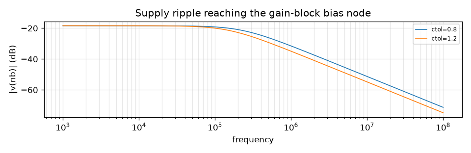
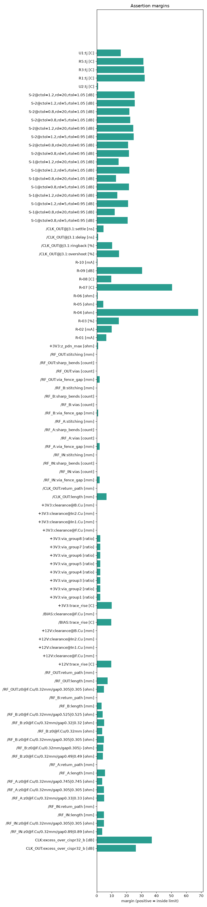

- [renders/rffe-back.svg](renders/rffe-back.svg)
- [renders/rffe-bottom.png](renders/rffe-bottom.png)
- [renders/rffe-front.svg](renders/rffe-front.svg)
- [renders/rffe-schematic.pdf](renders/rffe-schematic.pdf)
- [renders/rffe-top.png](renders/rffe-top.png)

### 8.1 Board analyses (S-parameters, PDN impedance, SI waveforms, heat map, emission estimate)

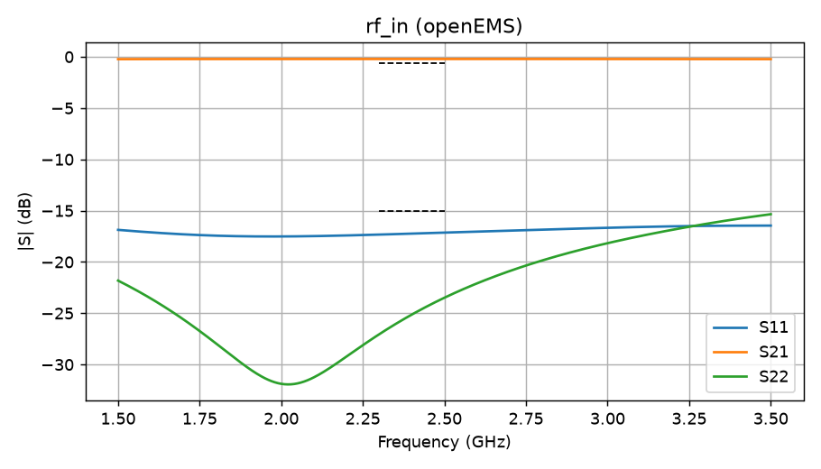
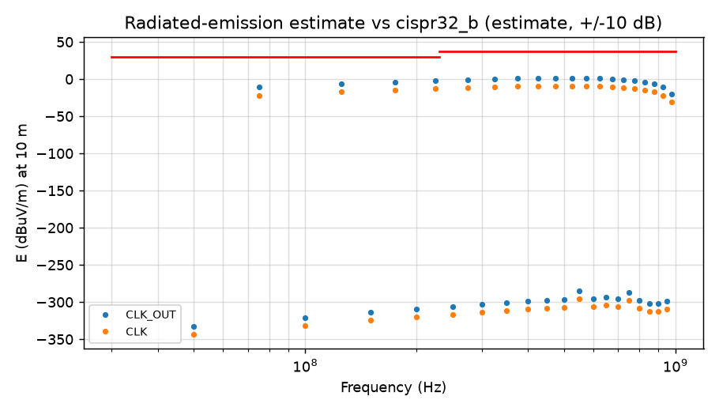
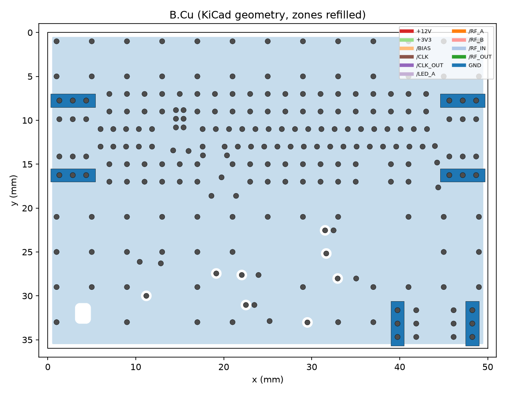
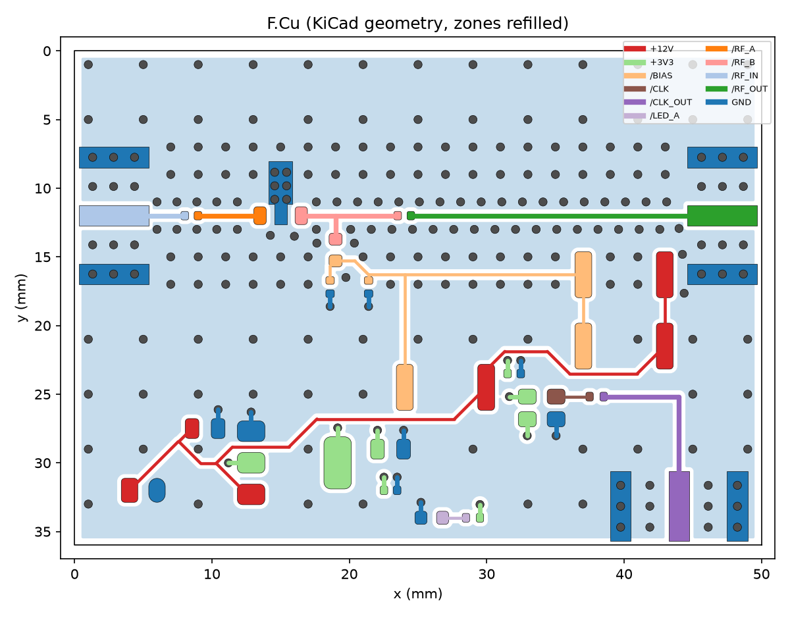
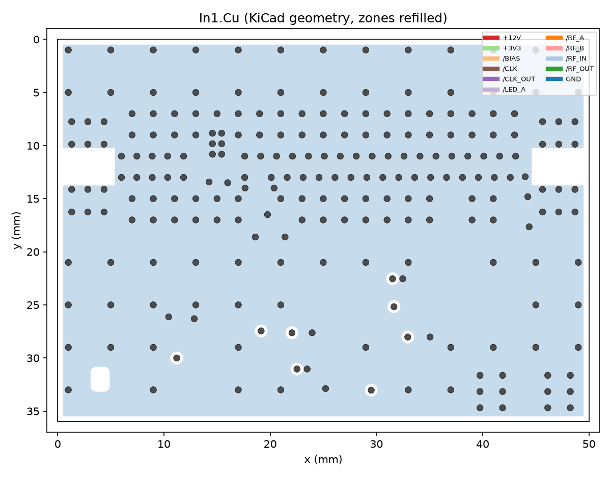
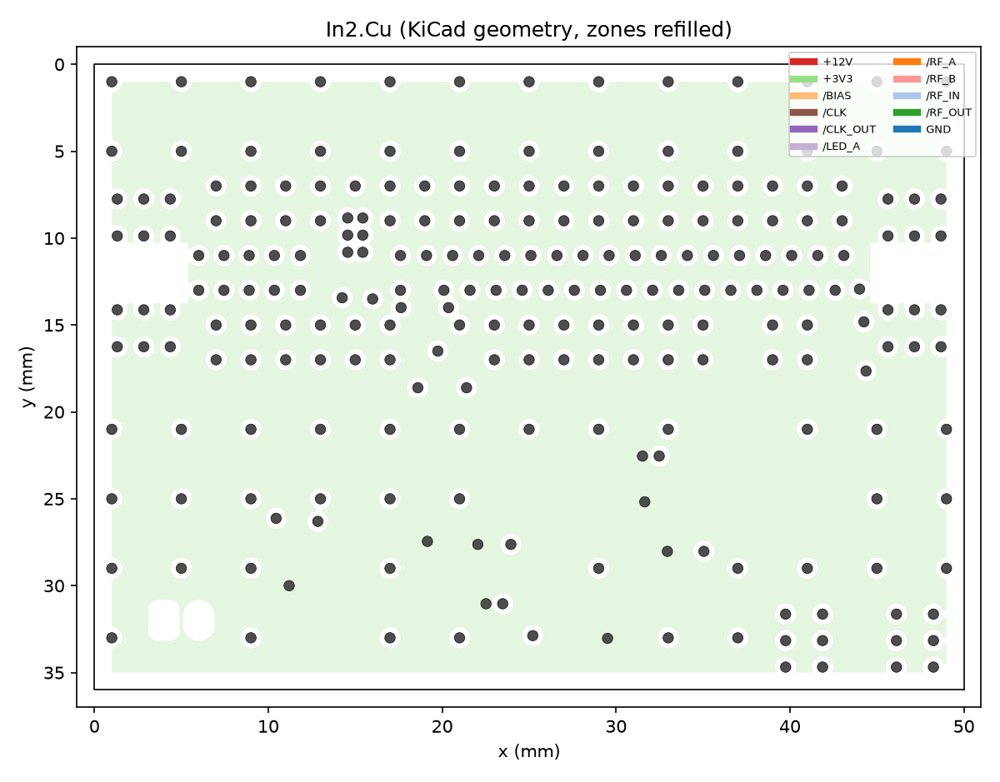
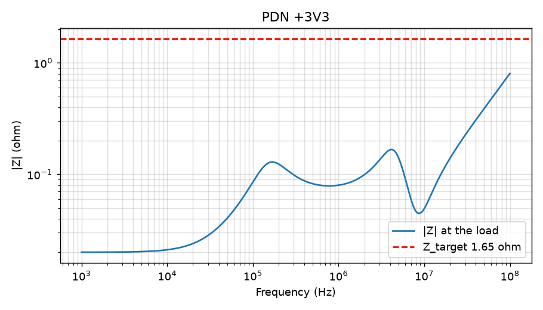
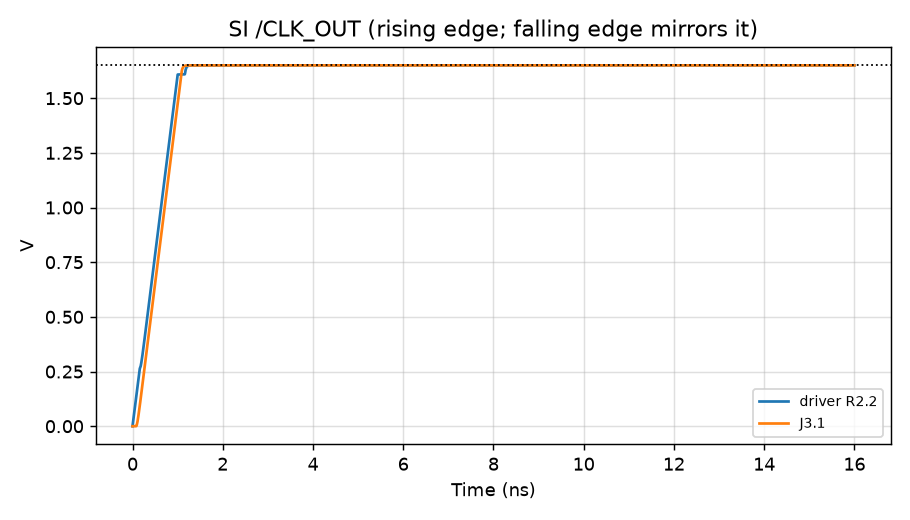
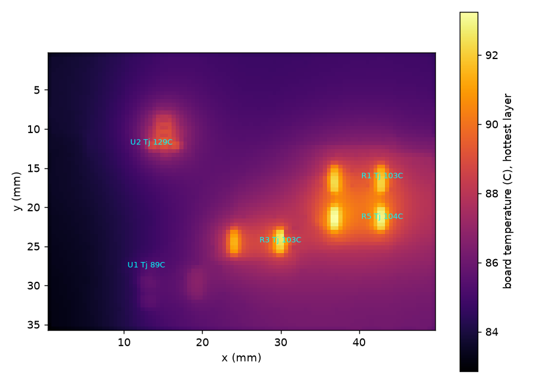

- [analysis/em/rf_in.s2p](../analysis/em/rf_in.s2p) (Touchstone / SPICE deck / openEMS model as simulated)
- [analysis/em/rf_in.xml](../analysis/em/rf_in.xml) (Touchstone / SPICE deck / openEMS model as simulated)
- [analysis/si/si-CLK_OUT.cir](../analysis/si/si-CLK_OUT.cir) (Touchstone / SPICE deck / openEMS model as simulated)

## 9. Release manifest

Configuration digest `da83c6a372b493b9cd0cbcfa19308026e312715640e92d632eab002551616416`; 33 controlled files.

| file | sha256 |
|---|---|
| design/em.tsv | 42b0267a37d6c384bf4834af059b97f85e61ef7148815a1a29656c800c5761c3 |
| design/emc.tsv | a6f9467968c890070b949503ca828142b99f9d2c903967576f056d15640c99ea |
| design/nets.tsv | 63084359b61794e7972f906347a93023d0fa6fc34b35b1b8b9fcda941701e87c |
| design/pdn.tsv | d5b3944691b5727ccf949c52caf2c6c8b7a8af1c1f0378a022d98cae4efe1725 |
| design/rf.tsv | f369c74d741273645a3d148070946f590e6ff92c2363b56e21acd4573c2059e5 |
| design/rules.tsv | 21267543d6597ec6b3685dc77e0b3a93958c097a91f7aefc553471d2908f6781 |
| design/si.tsv | 71d3c58bab7d9f390b0a6e54fc99ad7a7cb7c81005e1dff5e1811187af5acdcb |
| design/thermal.tsv | f814f54b5dff0e26096c5c88ae5cb5e8b359411ad7faa3155a5cb5ba066b4f34 |
| fab/gerbers/rffe-B_Cu.gbr | 91f080d3a8048099c474ea3db1f8ff8faa253ee056b9b177731914fb5d084284 |
| fab/gerbers/rffe-B_Mask.gbr | 487d9277eb7dfc19a191fee40e018251e27b377e31bfe72b0b9b0a76f541781c |
| fab/gerbers/rffe-B_Paste.gbr | db520ec26ccf3be9d7c1363c7f47aeeef3a337c467cf4a6aa025c05ebb2dc38f |
| fab/gerbers/rffe-B_Silkscreen.gbr | 141f627102804ee24f7ca4cf78bc3dfd559cfea763ebdf8efd71d367d90674b9 |
| fab/gerbers/rffe-Edge_Cuts.gbr | ed3528b7568236e63d31c3aa7dac8d51652d68d58c93aae228244f80a14b88b4 |
| fab/gerbers/rffe-F_Cu.gbr | a6dd237b32a4b3980298bae5e07c2257d2472767b725fb8e23c0c625ae9e824e |
| fab/gerbers/rffe-F_Mask.gbr | e64a9dcb187d3fd2daa236ec5ebf8ab523382025ab0a36e4aab82d30647d02a8 |
| fab/gerbers/rffe-F_Paste.gbr | da0af33e9df8c039f92dc3b2a78488ff58cc0f1ddbf1e7a851f8b6bdcd9d9801 |
| fab/gerbers/rffe-F_Silkscreen.gbr | b0655c3beca0eab381fcf51634e6e9bf90fd0b89c8e6d7dddfadd6e044c61c5c |
| fab/gerbers/rffe-In1_Cu.gbr | 42034e1a31e731f7df89b2da0fea679d7b7f18b9ee277acd8d504d1b6b919b8b |
| fab/gerbers/rffe-In2_Cu.gbr | 23008666809b1daf036bf031b4513d5a6ae2b1a64778d2d72f7a052ac1c427d9 |
| fab/gerbers/rffe-NPTH.drl | 044149de226a5d89c08a684ca4d8b96a4a2e3cba3d144794010630fdaa690ac9 |
| fab/gerbers/rffe-PTH.drl | e73b5dc91f5b1b681cdbb8b95ea1e9a5656faf0f637b308331a466a0bd86a59e |
| hrs/requirements.tsv | 20c6834b36bb71a14998d94f3d714e93d66b5581ef45847c7aeec6d95c1dd86e |
| pcb/fp-lib-table | 68b32e6f4628de6f3bd7d026f0c5c613e154ab2e3baa92a13ad7cad3b5a26cc8 |
| pcb/rffe.kicad_dru | b7f277f0ab7efc817eac4037e605f4d671cf2cfa2af53a9d750d736f3bcbac75 |
| pcb/rffe.kicad_pcb | 843978fcc5921768812d5b289a9ca0ad8369fcfb412da5fcac271e90a1a4208e |
| pcb/rffe.kicad_pro | 9ed21772ab1f5ed55913d145280e0f9fe03c9350a470b136f453716b9f47403c |
| pcb/rffe.kicad_sch | 7d188bd1c5912604333dd79205ed52739dbefd0768c6a414441a6ee9758d6c88 |
| pcb/rffe_symbols.kicad_sym | 20c356cb648a187cc7f9194b7cf7143ef8526602f2ce1ab68650abc45c958368 |
| pcb/sym-lib-table | 271bafd7313a550c40636e26e1e77cc4063b0c06f9d7f8d372b10e9e0b7588f1 |
| sch/circuit.json | 7fe517bd98857b037cf496327358fd18300c54ba7e4c6b2dbf46a1c44748bfbb |
| sch/connectivity.tsv | 0ffc987b574bf8fc86abee3b70ad8d28c76957536fd1b68b1ff167600187e25d |
| sim/assertions.tsv | b39274fda1e305806e13df4d3802296cc76dcc99fb2d1660c9dfed58408c4a12 |
| sim/bias_filter.cir | e3883be476d6fdc1541fbca31169845aa2c0f012cc6b67d98cefe0090d83507b |

## 10. References

[1] B. R. Archambeault, PCB Design for Real-World EMI Control. Boston, MA, USA: Kluwer Academic, 2002.
[2] E. Bogatin, Signal and Power Integrity—Simplified, 3rd ed. Boston, MA, USA: Prentice Hall, 2018.
[3] C. Bowick, J. Blyler, and C. Ajluni, RF Circuit Design, 2nd ed. Burlington, MA, USA: Newnes, 2008.
[4] D. Brooks and J. Adam, PCB Design Guide to Via and Trace Currents and Temperatures. Norwood, MA, USA: Artech House, 2021.
[5] P. Horowitz and W. Hill, The Art of Electronics, 3rd ed. New York, NY, USA: Cambridge Univ. Press, 2015.
[6] H. Johnson and M. Graham, High-Speed Signal Propagation: Advanced Black Magic. Upper Saddle River, NJ, USA: Prentice Hall, 2003.
[7] C. R. Paul, R. C. Scully, and M. A. Steffka, Introduction to Electromagnetic Compatibility, 3rd ed. Hoboken, NJ, USA: Wiley, 2022.
[8] T. Williams, EMC for Product Designers, 5th ed. Oxford, U.K.: Newnes, 2016.
[9] P. Wilson, The Circuit Designer's Companion, 3rd ed. Oxford, U.K.: Newnes, 2011.

Rule identifiers cited: -, AOE-3330, ARCH-065, ARCH-067, BOGATIN-167, BOGATIN-2110, BOGATIN-2128, BOGATIN-2132, BOGATIN-2135, BOGATIN-2147, BOGATIN-222, BOWICK-023, BROOKS-017, BROOKS-046, BROOKS-052, BROOKS-079, IPC-2152, IPC-2221, JOHNSON03-1278, JOHNSON03-1307, PAUL-1024, PAUL-1044, PAUL-2011, SOT-223, WILLIAMS-2038, WILSON-394
