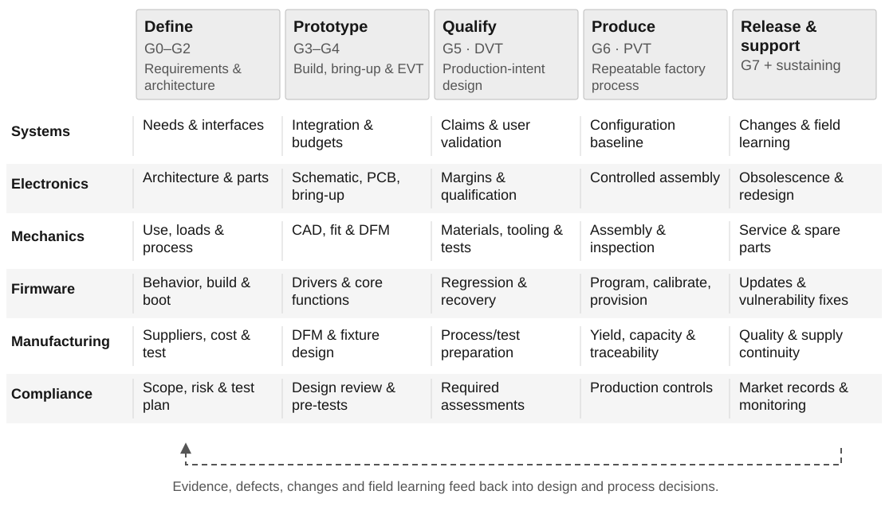

# From Requirements to a Marketable Hardware Product

## The development model

A marketable hardware product requires a useful design, evidence that it performs safely, a repeatable manufacturing process, the permissions and information required in each sales market, and an organization able to support it. Fabrication readiness is an intermediate engineering release. Firmware development begins with requirements and architecture and continues through manufacturing, field updates, and retirement.

There is no single universal, mandatory sequence called the hardware development pipeline. ISO/IEC/IEEE 15288:2023 defines system life-cycle processes from conception through retirement, permits iterative and concurrent application, and does not prescribe a development methodology. ISO/IEC/IEEE 29148:2018 supplies the requirements-engineering foundation.[^lifecycle][^requirements] A practical implementation combines systems engineering and traceability with the new-product-introduction stages commonly called EVT, DVT, and PVT. Their names, boundaries, and build sizes vary between organizations.[^evt][^dvt][^pvt]

**Recommended operating model:** establish requirements and architecture; develop electronics, mechanics, firmware, test, supply chain, and compliance together; release controlled prototype builds; demonstrate engineering performance; qualify the production-intent design; validate the factory process; authorize sales by market; and maintain the released configuration throughout its supported life.

This report covers general embedded and connected devices, robotics and industrial equipment, medical devices, and automotive electronics. It compares the United States, European Union, United Kingdom, and Taiwan, including products manufactured in Taiwan for export. The baseline concerns systems built from purchased components, circuit boards, firmware, enclosures, and assemblies. Custom semiconductor design and wafer tape-out require an additional development process and are outside this baseline.

Regulatory status is assessed as of **14 September 2026**. The gates, checklists, and example records below are an engineering synthesis, not verbatim requirements of a single standard. Standards references identify relevant scope; publicly available abstracts and official guidance were reviewed, rather than the complete licensed text of every standard. Product-specific classification, adopted editions, customer contracts, and applicable law determine the final acceptance criteria.

## The shared workflow and release gates

*Figure 1. Recommended lifecycle. Arrows indicate dependencies, not fixed durations. A failed gate returns the affected work to design, implementation, or process development.*

| Gate | Decision and minimum exit evidence | Accountable release owner |
|---|---|---|
| G0 — Opportunity | Intended users, problem, use environment, target markets, commercial assumptions, principal risks, and feasibility questions are defined. | Product/business owner |
| G1 — Requirements | Measurable system requirements, acceptance methods, regulatory scope, risk criteria, and an initial validation plan are baselined. | Systems lead, with quality/regulatory input |
| G2 — Architecture | Hardware/software allocation, interfaces, budgets, safety/security concepts, manufacturing approach, and major feasibility evidence are reviewed. | Systems lead and discipline owners |
| G3 — Prototype release | A specific board/assembly/enclosure revision has a complete, checked manufacturing package, accepted supplier queries, and a safe bring-up plan. | Design owner and manufacturing engineer |
| G4 — EVT exit | Integrated prototypes demonstrate core functions and performance; major architectural risks are resolved; remaining defects and next-build changes are explicit. | Systems/test lead |
| G5 — DVT exit | Production-intent design meets the planned verification, user validation, reliability, safety, and applicable compliance objectives. | Design authority and quality/regulatory owner |
| G6 — PVT exit | The intended factory process repeatedly builds, provisions, tests, and traces acceptable units at agreed quality, capacity, and cost. | Operations/manufacturing and quality |
| G7 — Market release | Each released SKU and market has its required approvals/declarations, labeling, instructions, supply, logistics, support, and business authorization. | Product/business owner with quality/regulatory authorization |

Production capability and legal market access are separate decisions. A pilot build may be permitted before commercial distribution. A passed engineering gate does not authorize selling or deploying devices where additional regulatory permission is required.

Every gate record should identify the configuration, evidence reviewed, unmet criteria, authorized exceptions, decision, decision owner, and conditions for reopening the review. A release score can show progress; it should not average away a failed mandatory criterion. Missing evidence remains unverified. An exception cannot substitute for a legal obligation.

## G0–G1: define the product and its requirements

Start with an intended-use description and operating scenarios. Identify who installs, operates, cleans, services, updates, and disposes of the product. Include foreseeable misuse and degraded situations: incorrect connections, interrupted power, unavailable networks, failed sensors, exhausted batteries, and maintenance errors. Define what constitutes success for the customer before choosing the processor or board size.

Capture the product requirements document, concept of operations, and system requirements at the level the team needs. A small team can maintain these as sections of one controlled document. Preserve unique requirement identifiers and relationships even when the documentation is compact. ISO 29148 addresses requirements processes and their information items across systems and software; it does not require a particular requirements-management tool.[^requirements]

The requirements baseline should cover these parallel concerns:

| Concern | Decisions to make measurable |
|---|---|
| User outcomes | Tasks, performance, usability, accessibility, setup time, operating limitations, and supported users |
| Electrical behavior | Input power range, consumption by operating state, interfaces, signal ranges, protection, and grounding |
| Physical behavior | Size, mass, mounting, connector access, temperature, mechanical loads, ingress, cleaning, and serviceability |
| Firmware and software | Timing, boot behavior, control states, memory, communication, diagnostics, updates, recovery, and compatibility |
| Reliability and safety | Intended life and mission profile, hazards, safe states, failure response, and acceptable residual risk |
| Manufacturing | Volume assumptions, assembly method, test access, calibration, traceability, acceptable defects, and repair |
| Commercial lifecycle | Target price and cost, supply horizon, support period, warranty assumptions, spare parts, and retirement |
| Market obligations | Countries, product classification, applicable rules, test standards, documentation, and responsible economic operators |

Write requirements with limits, units, conditions, and acceptance methods. “Low power” is ambiguous. “In the specified sleep state, at the stated supply and temperature, measured average input current shall remain below the allocated limit over the defined measurement interval” is testable. Set the actual numbers from the product need and engineering budget.

Create the verification and validation plan before implementation. Verification asks whether the product meets specified requirements. Validation asks whether it fulfills intended use and stakeholder needs. Analysis, inspection, demonstration, and test each have legitimate uses; the method must fit the claim. NASA’s systems-engineering guidance also emphasizes configuration identity, raw results, anomalies, and objective closure evidence.[^nasa]

**G1 exit checklist**

- [ ] Intended use, environments, users, markets, variants, and exclusions are agreed.
- [ ] Requirements have identifiers, measurable criteria, owners, and planned verification methods.
- [ ] Customer needs trace to requirements, including safety, security, manufacturing, and support.
- [ ] Unresolved assumptions have owners and planned experiments; feasibility is not assumed.
- [ ] Product classification and the applicable regulatory/standards matrix have an accountable owner.
- [ ] Budget, target economics, major dependencies, and commercial stop criteria are explicit.

## G2: architecture and feasibility

Allocate functions to electronics, firmware, mechanics, external services, people, and manufacturing operations. Choose a processor, RTOS, radio, sensor, power architecture, and enclosure process only after comparing them against the requirements. Include component lifecycle, supplier access, development tools, production programming, security features, and long-term maintenance in the decision.

Maintain system budgets for power and energy, peak current, thermal dissipation, signal accuracy, timing and latency, communications bandwidth, memory, mass, volume, and cost. An allocation needs a stated margin and a way to measure or justify it. There is no universal derating percentage or reserve margin suitable for every technology and safety class.

An interface-control document should connect the actual endpoints across the system: connector and pin, signal direction, voltage domain, current, pull state, timing, protocol version, mechanical datum, units, ownership, and behavior during startup or failure. A connector name appearing in two documents is insufficient proof that the assembled system is compatible.

Use focused experiments for the highest uncertainties: sensor accuracy in the real environment; radio performance with the intended antenna and enclosure; motor starting and stall loads; thermal behavior; algorithm timing; power conversion efficiency; and critical mechanical tolerances. Record model assumptions and uncertainty. Simulation informs these decisions but must be correlated with physical measurements when the eventual claim depends on physical performance.

Begin design-for-manufacturing, assembly, test, service, and supply review with potential manufacturers. Jabil describes engineering and NPI as including supply-chain analysis, design-for-X, pilot builds, and hardware/software work, which supports involving these functions before the final drawing release.[^jabil] For molded parts, supplier DFM can expose inadequate draft, thick walls, and gate/ejector constraints that a printable prototype does not reveal.[^molding]

Perform risk analysis at system and subsystem levels. FMEA identifies failure modes, consequences, and treatments, but is one analysis method rather than a complete assurance argument. IEC 60812 provides a framework for planning, performing, documenting, and maintaining FMEA/FMECA.[^fmea] For medical, automotive, and machinery products, use the applicable sector risk process described later.

**G2 exit checklist**

- [ ] Functional architecture and hardware/software responsibilities are baselined.
- [ ] Electrical, mechanical, communication, and firmware interfaces agree at both endpoints.
- [ ] Critical budgets include tolerances, worst cases, and justified margins.
- [ ] Highest-risk feasibility questions have evidence and an explicit disposition.
- [ ] Safety states, security architecture, recovery, programming, and test access are designed.
- [ ] Manufacturer feedback and procurement constraints are incorporated before layout/tooling commitment.

## G3: detailed design and fabrication readiness

Electronics work includes component selection, schematic review, power integrity, signal integrity where relevant, protection, layout, thermal paths, grounding, EMI control, and accessible test points. Mechanical work includes controlled CAD, drawings, tolerances, materials, finishes, fasteners, seals, harness routing, assembly sequence, tooling, and inspection features. Firmware should already have a build, board-support plan, programming route, and bring-up image.

Electrical-rule and design-rule checks are necessary automated checks, but their scope is limited to their configured rules and tool capabilities. Review the actual production files as well as the editable design. Confirm the intended rules were loaded, the checked revision matches the exported revision, and the manufacturing supplier has accepted unresolved engineering questions.

Use three distinct release terms:

| Release | What it establishes | Typical package |
|---|---|---|
| PCB fabrication ready | A supplier can fabricate the specified bare board. | Fabrication artwork/data, drill and route information, board outline, stack-up, material and copper requirements, finish, impedance and tolerance notes, fabrication drawing, revision identifier |
| Assembly ready | A supplier can populate and inspect the intended board variant. | Fabrication package plus BOM, exact manufacturer part numbers, approved alternates, do-not-populate rules, placement data, assembly drawings, polarity/orientation notes, panel/stencil instructions as agreed |
| Product build ready | The complete prototype or pilot unit can be assembled, programmed, and tested. | PCB assembly release plus mechanical drawings/CAD, harness details, fasteners, work instructions, firmware/provisioning release, calibration/test instructions, labels, configuration manifest |

Eurocircuits explicitly requires PCB data, a bill of materials, and component-placement information for its assembly workflow. Its front-end review checks consistency and manufacturability before production preparation.[^assemblydata][^assemblyreview] Gerber/drill plus BOM and placement files are common; an intelligent exchange format may be used when supported by the chosen supplier. The manufacturer’s agreed data contract determines the accepted format.

Specify workmanship and performance requirements separately. IPC design standards address board and assembly design topics; IPC-A-600 concerns bare-board acceptability, IPC-6012 rigid-board qualification/performance, J-STD-001 soldered-assembly process requirements, and IPC-A-610 assembly acceptability. Select the applicable class, edition, amendments, and customer exceptions in the purchase/release specification.[^ipcdesign][^ipccert] Passing a generic CAD rule deck does not establish conformance to every applicable IPC requirement.

**G3 exit checklist**

- [ ] Schematics, PCB, enclosure, harnesses, BOM, placement files, and firmware interface definitions use compatible revisions.
- [ ] ERC/DRC and relevant calculations run successfully on the release inputs; findings are resolved or formally dispositioned.
- [ ] Libraries, footprints, polarity, pin mapping, connector mating, and mechanical fit receive explicit review.
- [ ] The BOM identifies exact parts, quantities, approved alternates, lifecycle/availability risks, and sourcing assumptions.
- [ ] Manufacturer DFM/DFA queries are closed; critical dimensions, materials, stack-up, and acceptance requirements are agreed.
- [ ] Programming, debug, calibration, and production-test access physically exist.
- [ ] Bring-up procedures define power limits, instrumentation, safe states, and stop conditions.
- [ ] An immutable release manifest identifies all supplied files and their hashes or equivalent controlled identifiers.

## Firmware as a continuous workstream

Firmware cannot be left until after the PCB is finished. Choices about update storage, boot modes, watchdogs, recovery access, hardware identity, analog calibration, and production security can require different hardware. The firmware/hardware interface should be reviewed jointly before G3.

| Development stage | Firmware output and the hardware decision it influences |
|---|---|
| Requirements and architecture | State machine, timing, fault responses, update/support policy, memory budget, security boundary, and processor/peripheral selection |
| Before custom hardware | Build environment, versioned dependencies, application logic on host/dev kit, preliminary drivers, interface tests, bootloader and flash-partition design |
| First custom board | Board support, clocks/reset, pin multiplexing, power-state control, basic communications, device identity, diagnostics, and calibration hooks |
| EVT | Integrated functions, on-target timing and resource measurements, fault handling, telemetry, automated bench regression, and initial update/recovery tests |
| DVT | Release candidate, complete planned regression, stress/soak and fault-injection results, security review, compatibility matrix, signed-update/recovery qualification |
| PVT and launch | Controlled production binary, programming/provisioning procedure, factory-test mode, approved security lifecycle settings, release notes, field-support package |
| Sustaining | Vulnerability intake, dependency review, fixes, update rollout, regression against supported hardware, incident response, and end-of-support handling |

At architecture review, check power and reset sequencing, boot straps, clocks, pin states before firmware starts, bus addresses, interrupt priorities, sampling accuracy, calibration storage, memory endurance, debug access, and the ability to recover a failed unit. Real devices need calibration where the requirement depends on oscillator, sensor, analog, or mechanical variation. Keep calibration data versioned, bounded, traceable, and separate from a casual debug setting.

Use layered verification: host tests for suitable logic, simulation for supported behaviors, real-target integration tests, and hardware-in-the-loop tests for physical timing and interactions. A build-only result must be reported as build-only. Zephyr’s Twister documentation explicitly distinguishes compilation from executed tests and supports board revisions, device testing, and fixtures; it is an implementation example, not a required platform.[^twister]

Build security into development and maintenance. NIST SSDF supplies secure-development practices; the revised NIST IR 8259, published in April 2026, addresses foundational IoT-manufacturer activities before and after product introduction.[^ssdf][^iot] The product plan should identify supported components and dependencies, protected secrets, authorized interfaces, vulnerability reporting, and an accountable maintenance owner. Create a software bill of materials where required by the product’s obligations or needed for dependable vulnerability response.

For update-capable devices, establish authenticated updates, a recoverable installation mechanism, compatibility checks, and a deliberate rollback policy. MCUboot documents test boot, confirmation, and reversion as one concrete design pattern.[^mcuboot] Test interrupted downloads, truncated/corrupt images, wrong signatures, incompatible hardware, repeated power interruption, failed first boot, and storage exhaustion. Recovery to a working image and prevention of insecure downgrade must be reconciled in the design.

**Firmware release checklist**

- [ ] A controlled source revision, toolchain, dependency set, build configuration, and binary hash identify the release.
- [ ] Supported hardware and bootloader versions are explicit; memory/timing/power limits are measured on target.
- [ ] Safety states, watchdog recovery, communication failures, and sensor/actuator faults have test evidence.
- [ ] Update, authentication, compatibility, rollback, and recovery behavior are verified where applicable.
- [ ] Device identity, keys, calibration, and production debug settings are provisioned through a controlled process.
- [ ] Test credentials and unrestricted factory functions cannot escape into normal production use.
- [ ] Release notes, known issues, support responsibilities, dependency inventory, and field diagnostics are ready.

## G4–G6: prove the design and the manufacturing process

### EVT: engineering validation

EVT uses integrated prototypes to expose functional, performance, and architectural problems. Industry descriptions emphasize fit, form, function, component availability, assembly problems, and iteration.[^evt] Define the engineering questions for each build and allocate units to investigations before ordering them.

Bring up a new assembly progressively: inspect and check for shorts; energize through suitable protection and current limits; verify rails, sequencing, reset, clocks, and debug access; load a minimal diagnostic image; exercise interfaces and sensors; then enable loads and actuators under controlled conditions. Compare measured power, temperature, accuracy, and timing with architecture budgets. Record every rework and jumper so prototype results remain interpretable.

EVT closes when major technical risks have evidence and the next configuration is understood. A prototype that works once on a developer’s bench does not establish environmental capability, reliable production, or user suitability.

### DVT: design verification and validation

DVT is commonly called design validation testing, although organizations use both “verification” and “validation” in the name. It should resolve both obligations in the project’s plan. Use production-intent materials, components, PCB construction, mechanical tooling, firmware, and representative accessories wherever these affect the claim. MacroFab’s DVT guidance emphasizes final materials/tooling, electrical variation, environmental exposure, qualification, and reliability.[^dvt]

Execute the requirements-linked test plan across applicable modes, variants, supply extremes, temperatures, loads, tolerances, and use conditions. Include interface compatibility, EMC/radio, safety, security, reliability, packaging/transport, and intended-user validation. Select stress levels and sample sizes from the mission profile, hazards, applicable standards, expected variability, and the statistical claim. Neither “ten units passed” nor a supplier’s typical EVT/DVT batch size is a universal qualification rule.

A printed enclosure may establish fit while leaving molded-part strength, sealing, thermal behavior, and cosmetic quality unproven. Similarly, a substituted component or prototype cable can invalidate the relevance of an otherwise successful test. Document deviations from production intent and assess their effect before accepting evidence.

DVT closes with completed required evidence, resolved or appropriately dispositioned defects, and a controlled design baseline. A subsequent change triggers an impact assessment and the necessary repeated testing, including regulatory assessment where relevant.

### PVT: production validation

PVT demonstrates that the intended manufacturing system can produce the released design. Use the actual factory, line, operators, suppliers, tools, fixtures, work instructions, programming service, and quality controls. MacroFab describes this stage as a validation of production quality, speed, cost, and volume capability.[^pvt]

Define the control plan: incoming acceptance, assembly controls, inspections, programming, security provisioning, calibration, functional tests, traceability, nonconformance handling, rework, and final release. Validate the measurement system and the tests’ ability to detect representative faults. Maintain fixture calibration, known-good references, fault samples where appropriate, and controlled test limits.

| Manufacturing check | Main purpose | Practical limitation |
|---|---|---|
| AOI — automated optical inspection | Find visible assembly/placement/solder anomalies | Cannot establish hidden-joint quality or complete electrical function |
| AXI — automated X-ray inspection | Inspect selected hidden structures and solder joints | Coverage depends on equipment, inspection program, and interpretation |
| ICT / flying probe | Detect supported connectivity and component defects | Requires suitable access and test design; does not replace full functional testing |
| Boundary scan | Exercise supported digital interconnects | Requires device support and appropriate board/test architecture |
| Functional/end-of-line test | Confirm selected behaviors of the powered board or complete product | Proves only what the configured stimuli and measurements cover |
| Calibration and provisioning | Establish unit-specific accuracy, identity, configuration, and credentials | These operations require their own correctness and traceability checks |

Keysight’s manufacturing guidance treats ICT as part of a broader strategy that can include optical/X-ray inspection and functional testing.[^ict] Select coverage and equipment for the product’s risks and economics rather than buying every test technology.

Monitor first-pass yield with retests and rework kept separate; defect Pareto; scrap; escapes; calibration failures; cycle time; throughput; fixture availability; and cost per accepted unit. Specify the denominator, period, and configuration for every metric. Set process-capability targets only for suitable, stable measurement/process data and the applicable customer requirements.

**Combined validation exit checklist**

- [ ] EVT defects and reworks are reconciled with the released design.
- [ ] DVT samples and firmware are representative of the configuration being released.
- [ ] Required verification, user validation, compliance, and reliability evidence is complete.
- [ ] Test methods, sample allocation, limits, uncertainty, and exception handling were approved before results were accepted.
- [ ] PVT uses the intended line and personnel; fixtures and measurement systems are qualified for their purpose.
- [ ] Yield, rework, throughput, traceability, and cost meet agreed production criteria.
- [ ] Every shipped unit can be associated with its build configuration, test result, and provisioning/calibration record.

## Evidence, configuration, and change control

Use a traceability chain that connects the reason for the design to the product actually tested:

**User need → requirement → architecture/interface → design implementation → verification method → result → release configuration → manufactured unit.**

The chain should work in both directions. An unexplained component, firmware function, or test is a candidate for clarification; a requirement without implementation or evidence is an unresolved obligation. Requirement identifiers appearing in comments are not proof of implementation or successful verification.

| Evidence-record field | Example content, without prescribing a tool |
|---|---|
| Claim and criteria | Requirement ID, revision, measurable limits, units, conditions, and approved method |
| Configuration | PCB and assembly revision, BOM variant, mechanical revision, firmware/bootloader hashes, serial numbers |
| Execution | Procedure and script revision, instrument/fixture identification, calibration status, operator, timestamp, environment |
| Result | Raw measurements/logs, processed output, uncertainty or model limitations, pass/fail/not-run/error status |
| Disposition | Defect reference, corrective action, retest evidence, reviewer, and scope of any authorized exception |

Separate execution failure from an engineering failure. A simulation that did not run is an error; a successful simulation outside limits is a failed result. A stale result from another revision cannot establish a current pass. A test skipped because the fixture was unavailable remains unexecuted. NASA’s verification guidance supports recording versions, actual results, anomalies, and objective evidence of resolution.[^nasa]

Use an engineering-change process for component substitutions, PCB changes, firmware changes, tooling changes, test-limit changes, suppliers, and factory transfers. Assess effects on interfaces, safety/security, fit, performance, manufacturing, inventory, documentation, certification, and already-shipped products. Update the baseline and repeat the affected evidence. A “form-fit-function equivalent” purchase description alone cannot resolve all those effects.

## How the workflow changes by product class

### General embedded and connected products

Use the shared gates in proportion to electrical energy, environmental exposure, radio use, data sensitivity, user population, and failure consequences. A small sensor and a mains-powered heater share process concepts but require different hazard analyses and test programs. Choose the applicable product-safety family; do not apply one consumer-electronics test standard indiscriminately.

For connected products, include account setup, local operation during network loss, privacy/data handling, mobile/cloud compatibility, credential recovery, update delivery, service capacity, and the declared support period. NIST’s IoT baseline identifies device identification, configuration, data protection, logical access to interfaces, software update, and cybersecurity-state awareness as capability areas.[^iotbaseline] These should become product requirements and evidence, rather than a security document added at launch.

The commercial gate includes onboarding, packaging, instructions, customer support, warranty handling, and a credible cost to keep the product functioning and secure after sale.

### Robotics and industrial systems

Add system hazard analysis, motion and stored-energy hazards, safeguarding, foreseeable human access, stop/restart behavior, safe maintenance, and commissioning. An emergency-stop button is only one element; the complete safety function includes sensing, logic, actuation, power behavior, diagnostics, and validated response.

**Industrial robot hardware and an integrated robot cell have different scopes.** ISO 10218-1:2025 addresses industrial robots; ISO 10218-2:2025 addresses industrial robot applications and cells, including integration, commissioning, operation, maintenance, and decommissioning.[^robot1][^robot2] Their scope excludes several other robot classes, including medical and public-access service applications. A medical robot must follow its medical-device pathway as well as the relevant engineering safety work.

Select the machinery/control-system safety standards appropriate to the application, including ISO 13849-1 where applicable, and derive the required safety performance from risk assessment.[^machinerycontrol] For industrial cybersecurity, IEC 62443-4-1 addresses secure product development and maintenance; its developer obligations should be distinguished from an integrator’s or plant operator’s responsibilities.[^industrialcyber]

Add factory-acceptance and site-acceptance plans when installation affects performance or safety. Verify the real tooling, end effectors, payloads, cables, neighboring machinery, operator access, and interfaces. Release the installation configuration and operating limits with the product. Environmental robustness, maintainability, spare parts, and service response can be essential acceptance criteria for industrial customers.

### Medical devices

Define intended medical purpose and classification at G0–G1. The same sensor can follow a different regulatory path when its claimed purpose changes. Establish design and development controls within the applicable quality system, risk management, clinical/performance evidence, usability work, and post-market processes from the start.

In the United States, FDA’s QMSR became effective on **2 February 2026**, incorporating ISO 13485:2016 into the medical-device quality-system framework.[^qmsr] ISO 14971:2019 provides a lifecycle process for medical-device risk management, including monitoring the effectiveness of controls.[^medicalrisk] These requirements should influence architecture and verification before prototype release.

IEC 62304 concerns medical-device software development and maintenance; its scope explicitly does not cover final device validation and release.[^medicalsoftware] IEC 60601-1 addresses basic safety and essential performance of medical electrical equipment, with applicable collateral and particular standards.[^medicalelectrical] Depending on the device, plan additional biological, sterilization, cleaning, electrical, EMC, usability, or other evidence. Clinical evidence requirements depend on device classification, intended purpose, and regulatory pathway; a new clinical trial is not a universal requirement for every device.

FDA’s **February 2026** cybersecurity guidance supersedes the June 2025 version and addresses device design, labeling, premarket documentation, and cyber-device provisions.[^medicalcyber] Treat software dependencies, threat modeling, update support, and vulnerability response as regulated product-development concerns where applicable.

The final release package must connect design inputs and outputs, reviews, risk controls, verification, validation, design transfer, manufacturing controls, and required regulatory submissions. Follow the current jurisdictional record requirements rather than relying only on legacy names for quality-system files. EVT/DVT/PVT can organize builds, but do not replace the medical design-control and authorization process.

### Automotive electronics

Begin with vehicle-level intended function, operating environment, integration responsibility, customer requirements, and the item’s safety relevance. Allocate requirements and interface responsibilities between the OEM and suppliers. A controller can satisfy its bench specification while the vehicle-level function remains unvalidated.

ISO 26262 addresses functional safety of safety-related E/E systems in series-production road vehicles. It requires a safety lifecycle appropriate to the item and its risks.[^automotivesafety] Plan hazard analysis, safety goals, applicable integrity classification, safety requirements, verification, and the necessary independent confirmation within that lifecycle. Do not assign an automotive safety integrity level simply because a component is installed in a vehicle.

ISO 21448 addresses safety of intended functionality for relevant sensor/algorithm-dependent functions, including insufficiencies that are different from the malfunctions addressed by ISO 26262.[^sotif] ISO/SAE 21434 addresses automotive cybersecurity engineering across the lifecycle.[^automotivecyber] These analyses interact but answer different questions.

Manufacturing/customer approval commonly adds APQP, control plans, FMEA, measurement-system analysis, statistical process control, and PPAP. AIAG’s current materials distinguish APQP third edition and the standalone Control Plan first edition; the applicable OEM/customer contract determines the deliverables and submission level.[^apqp] Component-grade claims and individual component qualifications do not establish vehicle or ECU qualification.

For applicable vehicle categories and jurisdictions, UN Regulations 155 and 156 add vehicle cybersecurity-management and software-update-management obligations.[^unvehicle] Treat these as vehicle/type-approval responsibilities with supplier contributions, rather than a universal certification label for every circuit board. Plan system/vehicle integration, relevant environmental and electrical stress profiles, diagnostics, manufacturing traceability, change notification, field updates, and service compatibility with the customer.

## Market access: United States, EU, UK, and Taiwan

Create a compliance matrix at G1 and maintain it through G7. Each row should identify the product/SKU, destination, legal category, applicable rule, adopted test standard and edition, assessment route, responsible organization, required sample/configuration, label/instruction, evidence location, and relevant effective date. A lab can execute tests, but product classification and manufacturer obligations still need accountable ownership.

### General electronics and connected products

| Market | Requirements to determine before release | Implication for the workflow |
|---|---|---|
| United States | FCC authorization for applicable intentional and unintentional radiators; product-specific consumer-safety requirements; applicable workplace electrical approvals | Plan the radio/EMC route, final host configuration, test records, labeling, and responsible parties. Some unintentional radiators use SDoC or certification; intentional radiators generally require certification, subject to rule-specific exceptions.[^fccdigital][^fccradio] |
| European Union | Applicable CE legislation, such as RED for radio equipment or EMC/LVD where their scope applies; RoHS; relevant consumer safety, waste, and cybersecurity obligations | Determine all applicable legislation and the conformity-assessment route. Maintain technical documentation, EU declaration of conformity, markings, instructions, and required economic-operator information.[^ce][^red][^rohs] |
| Great Britain and Northern Ireland | Product-specific UK rules and marking routes; PSTI for covered consumer connectable products; distinct NI arrangements | The UK government’s March 2026 table recognizes CE and/or UKCA routes for many GB sectors. It lists NI separately and gives medical devices a distinct regime; a single blanket “UKCA required” rule is inaccurate.[^ukmarks] |
| Taiwan | BSMI mandatory commodity-inspection scope and scheme; NCC requirements for controlled radio-frequency equipment; applicable CNS standards, restricted-substance information, marks, and instructions | Identify the exact regulated commodity and radio classification. BSMI’s current lists include 2026 updates. Its schemes include RPC, type-approved batch/batch inspection, and DoC depending on the product.[^bsmi][^bsmischemes] NCC rules separately govern covered RF devices.[^ncc] |

FCC modular approval has specific conditions, including integration-related requirements. An approved radio module does not automatically establish every obligation for the finished host product.[^fccmodule] Similarly, a compliant power supply or certified component should be treated as supporting evidence within the completed product’s assessment.

For US general-use products subject to consumer-product safety rules, CPSC identifies testing and certification duties. Its current guidance also flags certificate eFiling for most regulated consumer-product imports from **8 July 2026**.[^cpsc] OSHA’s NRTL program addresses approval of specified workplace products; applicability should be determined separately from FCC compliance.[^nrtl]

For EU consumer products, assess the General Product Safety Regulation where applicable, including traceability and responsible-operator obligations. For covered electrical/electronic equipment, WEEE producer registration, reporting, and waste responsibilities also require operational preparation.[^gpsr][^weee] Passing EMC testing does not complete these obligations.

For lithium batteries, include transport classification, packaging, documentation, and applicable UN 38.3 design-test evidence/test-summary availability. PHMSA’s guidance explains test-summary requirements. Battery transport compliance is separate from the product’s overall electrical and battery-safety assessment.[^battery]

### Current cybersecurity and machinery transitions

- **EU CRA:** Article 14 reporting obligations apply from **11 September 2026**; the main regulation applies from **11 December 2027**. Covered manufacturers therefore need an operational reporting process now for actively exploited vulnerabilities and severe security incidents. The Commission summary also describes cybersecurity risk assessment, vulnerability handling, technical documentation, and support-period disclosure.[^cra]
- **UK PSTI:** In force since **29 April 2024** for covered consumer connectable products. Requirements include unique-per-product or user-defined passwords, information for reporting security issues, publication of the minimum security-update period, and an accompanying statement of compliance. Scope and exceptions must be checked for each product.[^psti]
- **EU machinery:** The Machinery Directive remains the relevant baseline before **20 January 2027**; the Machinery Regulation (EU) 2023/1230 applies from that date. Products whose first market placement crosses this date need the correct regulatory baseline in their launch plan.[^eumachinery]

### Additional sector routes

| Sector / market | Additional market-release question |
|---|---|
| US medical | Is the device exempt from premarket review, eligible for 510(k), appropriate for De Novo, or subject to PMA/another route? FDA distinguishes these pathways by classification, risk, and predicate circumstances.[^fdapath] |
| EU medical | Does MDR or IVDR apply, what conformity assessment is required, and are manufacturer, authorized representative, importer, and distributor obligations covered? Clinical/performance evidence must match the device and intended purpose.[^eumedical][^euclinical] |
| UK medical | Has the device met MHRA registration, relevant responsible-person, marking, and applicable CE-transition conditions? Current guidance allows EU MDR/IVDR-compliant devices in GB through 30 June 2030, while other device/certificate routes differ.[^ukmedical] |
| Taiwan medical | Are TFDA classification, license/listing requirements, and the relevant manufacturer QMS/QSD route resolved? Product authorization and manufacturer quality-system assessment are separate work items.[^tfdalicense][^tfdaqms] |
| Industrial/robotics | Are machinery/product obligations, workplace installation requirements, and final application/commissioning responsibilities identified for the destination? The integrated application can create obligations beyond the supplied robot or board.[^robot2][^eumachinery] |
| Automotive | Are OEM approval, production-part acceptance, applicable vehicle regulations/type approval, and cybersecurity/update responsibilities allocated between parties? Check the actual vehicle category and destination.[^apqp][^unvehicle] |

**Taiwan manufacture plus export:** maintain separate records for manufacturing location and each destination market. Taiwanese manufacture or domestic approval does not itself establish US, EU, or UK market access. Reuse qualified test evidence only where the destination’s rules, recognized methods, product configuration, and acceptance route permit it. Resolve export-specific treatment under the relevant Taiwanese requirements rather than assuming every domestic inspection provision either applies or is exempt. Identify the importer/responsible operator, customs classification, language, regional firmware/radio settings, and labeling for every released destination.

## G7: a complete commercial release

Translate the prototype BOM into a commercial cost model. Include purchased components, bare boards, assembly, enclosures, harnesses, test and calibration, programming, yield loss, rework, packaging, logistics, duties, tooling and other nonrecurring costs, warranty, returns, spares, and ongoing software/cloud/security support. State which costs are recurring, volume-dependent, or amortized. A low component BOM does not establish a viable product margin.

Build a supply plan with approved suppliers, lifecycle monitoring, minimum order quantities, lead times, alternates, capacity, inventory exposure, and change-notification arrangements. Check that the product can still be serviced and supported if a supplier withdraws a component or a cloud dependency changes. Use explicit scenarios rather than an unsupported universal lead-time or cost contingency.

Release a sellable SKU: configuration, accessories, packaging, labels, region settings, documentation, compatible software, and included services. Validate installation, onboarding, normal use, cleaning/maintenance, service, and recovery with the intended users. Prepare support escalation, returns authorization, failure analysis, repair/refurbishment rules, and recall/field-action procedures where applicable.

**G7 market-release checklist**

- [ ] Every SKU and destination has completed its applicable regulatory route and required records.
- [ ] The approved label, instructions, declarations/statements, language, and economic-operator details accompany the product as required.
- [ ] Supplier capacity, component availability, production acceptance, and logistics support the launch commitment.
- [ ] Commercial approval uses a complete cost model, price, margin, working-capital, and warranty/support assumptions.
- [ ] Installation, onboarding, intended-user tasks, accessories, and service procedures have validation evidence.
- [ ] Support staff, vulnerability contact, update delivery, incident response, spares, and returns handling are operational.
- [ ] The release identifies who may authorize shipment, stop shipment, approve a change, and initiate a field action.

## Sustaining engineering and retirement

Monitor manufacturing drift, field failures, returns, customer complaints, vulnerability reports, dependency changes, component obsolescence, and changes to applicable requirements. Connect each signal to the affected product configurations and serial/batch ranges. Feed the resulting corrective actions back into the risk analysis, requirements, design, tests, manufacturing controls, and user information.

Maintain a supported hardware/firmware matrix. A new image should not be assumed compatible with every historical board revision. Validate updates against supported configurations, monitor rollout, and keep recovery and service mechanisms available under the product’s security policy. NIST’s manufacturer guidance and IEC’s industrial secure-development lifecycle both extend product responsibilities into maintenance and retirement.[^iot][^industrialcyber]

At end of life, plan the final procurement or replacement path, service/spares horizon, end-of-sale and end-of-support communications, final firmware behavior, secure data removal, credential revocation, cloud shutdown consequences, and recycling/disposal arrangements. A device’s supported life should be a product requirement and funded business commitment.

**Sustaining checklist**

- [ ] Production and field quality metrics identify configuration, batch/serial range, and reporting period.
- [ ] Complaints, failures, vulnerabilities, and supplier notices have accountable triage and escalation.
- [ ] Changes receive impact analysis, required revalidation, and updated production/service records.
- [ ] Update compatibility, recovery, and deployment monitoring cover supported hardware versions.
- [ ] Support duration, spare parts, key ownership, and third-party service dependencies remain funded and assigned.
- [ ] Retirement addresses customers, installed devices, data, credentials, service shutdown, and disposal.

## Putting the workflow into operation

Use the smallest controlled record set that preserves decisions and evidence. A single repository and a structured issue tracker may suffice for a small unregulated project. More regulated or distributed programs may need validated quality-system tools and stronger access, review, retention, and electronic-record controls. The process obligations determine those needs; document count is not a measure of assurance.

| Controlled record | What it connects |
|---|---|
| Product/system requirements | Intended use, product claims, technical limits, market constraints, and acceptance criteria |
| Architecture and interfaces | Subsystem responsibilities, budgets, connector/pin/protocol definitions, physical interfaces, and failure behavior |
| Risk and compliance matrix | Hazards/threats, controls, applicable obligations, evidence, and residual-risk decisions |
| Design and release manifest | CAD, BOM, firmware, build tools, supplier files, variants, and exact released configuration |
| Verification/validation plan and results | Requirement coverage, procedures, samples, instruments, raw results, defects, and accepted conclusions |
| Manufacturing/control plan | Suppliers, instructions, inspection, test, calibration, provisioning, traceability, and rework |
| Change and nonconformance record | What changed or failed, affected configurations, disposition, retest, and authorization |
| Launch and lifecycle plan | Market access, economics, logistics, user documentation, service, security support, and retirement |

The companion **stage-gate-checklist.csv** provides an editable starting ledger. Complete the scope/applicability, responsible owner, criterion, and planned evidence before marking a row passed. Suggested statuses are not started, in progress, passed, failed, blocked, and not applicable. “Not applicable” requires a recorded rationale. An exception must identify the authorized decision, scope, risk treatment, and any expiry; it does not convert missing evidence into a test pass.

Avoid fixed calendar promises until the critical path is known. Typical dependencies include component availability, PCB spins, tooling changes, test-fixture development, compliance-lab capacity, reliability-test duration, clinical/customer studies, certification review, and manufacturing ramp. Parallel work can shorten elapsed time, but cannot remove the dependency of a final result on a representative configuration.

### Example: a connected environmental monitor

At G1, define measurement accuracy, operating environment, installation, power, communications, update support, and destination markets. At G2, allocate the sensor/error and energy budgets, decide calibration and data storage, and prove antenna/enclosure feasibility. Develop firmware on a development board while electronics and mechanics are designed.

At G3, release matching PCB, BOM, enclosure, programming access, and bring-up firmware. EVT establishes integrated accuracy, power, communications, and fault behavior. DVT repeats the planned claims on production-intent units under the required environmental and user conditions. PVT establishes repeatable assembly, calibration, identity provisioning, final test, and traceability. G7 authorizes the documented SKU for its markets with user instructions and an operational support/update process.

If the claimed purpose changes to clinical diagnosis, the medical-device classification and evidence path must be reassessed. If it controls a hazardous process, the safety-related architecture and assurance work changes. The product’s purpose and consequences determine the additional lifecycle work, not the fact that the same microcontroller appears in all three versions.

## Implications for Anvil

For a hardware-design assistant, the useful role is to maintain consistency, prepare reviewable artifacts, execute reproducible checks, and connect evidence to release decisions. Physical measurements, factory validation, clinical or vehicle-level evidence, and regulatory authorization remain distinct external work products.

The local Anvil assessment at commit f01f41a found false-pass conditions involving missing evidence, stale outputs, inactive fabrication rules, incomplete simulation coverage, and weak cross-file checks.[^anvil] Those findings make dependable gate semantics the first priority for aligning the plugin with this lifecycle.

| Priority | Capability and acceptance condition |
|---|---|
| 1 — Trustworthy checks | Missing inputs, parser errors, tool failures, skipped mandatory cases, and stale results cannot produce a pass. Every result is tied to its inputs and execution. |
| 2 — Explicit release scope | Distinguish PCB fabrication, assembly, product prototype, design qualification, production, and market release. A FAB_READY result states the precise package and permitted next step. |
| 3 — System consistency | Validate actual requirement links, interface endpoints, BOM parts, board/mechanical compatibility, firmware configuration, and release manifests. |
| 4 — Firmware and factory evidence | Support build/target-test evidence, bring-up, calibration, provisioning, manufacturing-test definitions, and serial/configuration records. |
| 5 — Sector and market tailoring | Record applicable obligations and evidence owners without presenting a generic checklist or numerical score as certification. |

## Sources

Numbered references link directly to the original sources. Standards catalogue pages establish scope and publication status; they do not replace the licensed normative text or jurisdiction-specific adoption. Manufacturer sources describe actual industry practice, with their sample counts, tool choices, and commercial claims treated as vendor-specific. Regulatory references were checked against the research date stated above. The workflow, gate wording, operating examples, and checklists are the synthesis of this report.

[^lifecycle]: ISO, [ISO/IEC/IEEE 15288:2023 — Systems and software engineering: System life cycle processes](https://www.iso.org/standard/81702.html), edition 2, May 2023. Scope and lifecycle-methodology provisions in the public abstract.

[^requirements]: ISO, [ISO/IEC/IEEE 29148:2018 — Systems and software engineering: Life cycle processes — Requirements engineering](https://www.iso.org/standard/72089.html), edition 2, November 2018; confirmed in 2024. Public scope and information-item description.

[^evt]: MacroFab, [EVT: The First Step in PCBA Product Development](https://www.macrofab.com/blog/evt-pcba-product-development), 16 July 2022. Manufacturer account of engineering builds and iteration.

[^dvt]: MacroFab, [DVT: The Next Step in PCBA Product Development](https://www.macrofab.com/blog/dvt-pcba-product-development), 21 July 2022. Production-intent design testing and qualification.

[^pvt]: MacroFab, [PVT: The Last Step in PCBA Product Development](https://www.macrofab.com/blog/pvt-pcba-product-development), 9 August 2022. Production-process validation and ramp.

[^nasa]: NASA, [Systems Engineering Handbook, chapter 5: Product Realization](https://www.nasa.gov/reference/5-0-product-realization/), NASA/SP-2016-6105 Rev. 2, online reference. Verification, validation, configuration identity, and result documentation.

[^jabil]: Jabil, [Electronics engineering and manufacturing capabilities](https://www.jabil.com/capability/electronics.html), current capability page. Design-for-X, engineering, supply-chain analysis, and NPI.

[^molding]: Protolabs, [Injection Molding Quality Control and Standards](https://www.protolabs.com/services/injection-molding/quality/), current manufacturing guidance. DFM, documented molding processes, and inspection options.

[^fmea]: IEC, [IEC 60812:2018 — Failure modes and effects analysis (FMEA and FMECA)](https://webstore.iec.ch/en/publication/26359), 2018. Public scope.

[^assemblydata]: Eurocircuits, [BOM and CPL Data](https://www.eurocircuits.com/technical-guidelines/pcb-assembly-guidelines/bom-cpl-data/), current PCB-assembly guidelines.

[^assemblyreview]: Eurocircuits, [Front-End Data Preparation](https://www.eurocircuits.com/technical-guidelines/assembly-manufacturing-technology/front-end-data-preparation/), current manufacturing-technology guidance.

[^ipcdesign]: IPC, [IPC Design Standards](https://www.ipc.org/ipc-design-standards), official design-standard scope guide. Confirm the contracted edition independently.

[^ipccert]: IPC, [IPC Document Revision Table](https://www.ipc.org/ipc-document-revision-table), official titles identifying IPC-A-600, IPC-A-610, IPC-6012, and J-STD-001 subject areas. This report does not treat the displayed revisions as a universal contractual baseline.

[^twister]: Zephyr Project, [Test Runner (Twister)](https://docs.zephyrproject.org/latest/develop/twister/index.html), current project documentation. Executed versus build-only tests, boards, device testing, and fixtures.

[^ssdf]: NIST, Souppaya, Scarfone, and Dodson, [SP 800-218 — Secure Software Development Framework, version 1.1](https://csrc.nist.gov/pubs/sp/800/218/final), February 2022. Established final publication; version 1.2 was published as an initial public draft in December 2025.

[^iot]: NIST, Fagan et al., [IR 8259 Rev. 1 — Foundational Cybersecurity Activities for IoT Product Manufacturers](https://csrc.nist.gov/pubs/ir/8259/r1/final), 20 April 2026. Supersedes the 2020 edition.

[^mcuboot]: MCUboot project, [Bootloader Design](https://docs.mcuboot.com/design.html), current project documentation. Image validation, confirmation, reversion, and interrupted-update handling.

[^ict]: Keysight, [In-Circuit Test for Manufacturing](https://www.keysight.com/ie/en/products/in-circuit-test-for-manufacturing.html), current manufacturer guidance. Test coverage and complementary production-test methods.

[^iotbaseline]: NIST, Fagan et al., [IR 8259A — IoT Device Cybersecurity Capability Core Baseline](https://csrc.nist.gov/pubs/ir/8259/a/final), May 2020. Device cybersecurity capability areas.

[^robot1]: ISO, [ISO 10218-1:2025 — Robotics: Safety requirements — Industrial robots](https://www.iso.org/standard/73933.html), edition 3, February 2025. Public scope and exclusions.

[^robot2]: ISO, [ISO 10218-2:2025 — Robotics: Safety requirements — Industrial robot applications and robot cells](https://www.iso.org/standard/73934.html), edition 2, February 2025. Integration and application lifecycle scope.

[^machinerycontrol]: ISO, [ISO 13849-1:2023 — Safety of machinery: Safety-related parts of control systems — General principles for design](https://www.iso.org/standard/73481.html), edition 4, 2023. Public catalogue entry.

[^industrialcyber]: IEC, [IEC 62443-4-1:2018 — Secure product development lifecycle requirements](https://webstore.iec.ch/en/publication/33615), January 2018. Industrial product developer/maintainer scope.

[^qmsr]: FDA, [Quality Management System Regulation (QMSR)](https://www.fda.gov/medical-devices/postmarket-requirements-devices/quality-management-system-regulation-qmsr), update 2 February 2026. Effective date and incorporation of ISO 13485:2016.

[^medicalrisk]: ISO, [ISO 14971:2019 — Medical devices: Application of risk management to medical devices](https://www.iso.org/standard/72704.html), edition 3, December 2019; confirmed in 2025. Public scope.

[^medicalsoftware]: IEC, [IEC 62304:2006 — Medical device software: Software life cycle processes](https://webstore.iec.ch/en/publication/6792), with [Amendment 1:2015](https://webstore.iec.ch/en/publication/22790). Public scope distinguishes software lifecycle work from final device validation/release.

[^medicalelectrical]: IEC, [IEC 60601-1 — Medical electrical equipment: General requirements for basic safety and essential performance](https://webstore.iec.ch/en/publication/2612), public family scope, and [edition 3.2 consolidated preview, including Amendment 2:2020](https://webstore.iec.ch/en/iec_catalog/product/preview/?id=L3B1Yi9wZGYvcHJldmlldy9pbmZvX2llYzYwNjAxLTF7ZWQzLjJ9ZW4ucGRm). Select the applicable adopted edition and collateral/particular standards.

[^medicalcyber]: FDA, [Cybersecurity in Medical Devices: Quality Management System Considerations and Content of Premarket Submissions](https://www.fda.gov/regulatory-information/search-fda-guidance-documents/cybersecurity-medical-devices-quality-management-system-considerations-and-content-premarket), final guidance, February 2026; supersedes June 2025 guidance.

[^automotivesafety]: ISO, [ISO 26262-2:2018 — Road vehicles: Functional safety — Management of functional safety](https://www.iso.org/standard/68384.html), edition 2, December 2018, and [ISO 26262 series overview](https://www.iso.org/publication/PUB200262.html). Public scope and series structure.

[^sotif]: ISO, [ISO 21448:2022 — Road vehicles: Safety of the intended functionality](https://www.iso.org/standard/77490.html), edition 1, June 2022. Public scope and distinction from malfunction and cybersecurity hazards.

[^automotivecyber]: ISO/SAE, [ISO/SAE 21434:2021 — Road vehicles: Cybersecurity engineering](https://www.iso.org/standard/70918.html), August 2021. Public lifecycle scope.

[^apqp]: AIAG, [APQP and Control Plan manuals and training](https://go.aiag.org/apqp-cp), official current guidance on APQP third edition, Control Plan first edition, and related automotive core tools.

[^unvehicle]: UNECE, [Three landmark UN vehicle regulations enter into force](https://unece.org/media/transport/Vehicle-Regulations/press/352397), January 2021, and [UN Regulation No. 156 — Software update and software update management system](https://unece.org/transport/documents/2021/03/standards/un-regulation-no-156-software-update-and-software-update), March 2021. Scope references; destination-specific applicability and later amendments require project-level review.

[^fccdigital]: US eCFR, [47 CFR § 15.101 — Equipment authorization of unintentional radiators](https://www.ecfr.gov/current/title-47/chapter-I/subchapter-A/part-15/subpart-B/section-15.101), current rule.

[^fccradio]: US eCFR, [47 CFR § 15.201 — Equipment authorization requirement](https://www.ecfr.gov/current/title-47/chapter-I/subchapter-A/part-15/subpart-C/section-15.201), current intentional-radiator rule and exceptions.

[^ce]: European Commission, [CE marking: Manufacturers](https://single-market-economy.ec.europa.eu/single-market/goods/ce-marking/manufacturers_en), official manufacturer-obligations guidance.

[^red]: European Commission, [Radio Equipment Directive](https://single-market-economy.ec.europa.eu/sectors/electrical-and-electronic-engineering-industries-eei/radio-equipment-directive-red_en), current guidance on Directive 2014/53/EU and related requirements.

[^rohs]: European Commission, [RoHS Directive](https://environment.ec.europa.eu/topics/waste-and-recycling/rohs-directive_en), current official restricted-substances policy guidance.

[^ukmarks]: UK Department for Business and Trade, [Product regulations by sector and current approaches to product marking: UKCA and CE regimes](https://www.gov.uk/government/publications/product-regulations-by-sector-and-current-approaches-to-product-marking-ukca-and-ce-regimes/product-regulations-by-sector-and-current-approaches-to-product-marking-ukca-and-ce-regimes), 31 March 2026.

[^bsmi]: Taiwan BSMI, [Regulated Products](https://www.bsmi.gov.tw/wSite/lp?BaseDSD=7&CtUnit=4131&ctNode=9845), current official list; includes electronic-product update of 10 March 2026 and mechanical-product update of 24 April 2026.

[^bsmischemes]: Taiwan BSMI, [Taiwan Commodity Inspection Schemes for Electrical and Electronic Products](https://www.bsmi.gov.tw/wSite/public/Data/f1744249855063.pdf), information booklet version 1.86, updated 10 April 2025. Scheme descriptions; current commodity announcements govern detailed scope.

[^ncc]: Taiwan NCC, [Telecommunications Management Act, Articles 65–67](https://ncclaw.ncc.gov.tw/Eng/PrintFLAWDAT0201.aspx?beginpos=18&id=FL091365&keyword=), official English text, amendment dated 5 August 2026. Controlled radio-frequency device manufacture/import and trading provisions.

[^fccmodule]: Texas Instruments, [Design Considerations for CC1312PSIP FCC and IC Certified RF Module](https://www.ti.com/lit/an/swra797/swra797.pdf), application note SWRA797. Primary manufacturer example of modular-authorization conditions, final-host obligations, and integration documentation.

[^cpsc]: US CPSC, [General Use Products: Certification and Testing](https://www.cpsc.gov/Business--Manufacturing/Testing-Certification/General-Use-Products-Certification-and-Testing), current business guidance, including the 8 July 2026 eFiling notice.

[^nrtl]: US OSHA, [Nationally Recognized Testing Laboratory Program: Frequently Asked Questions](https://www.osha.gov/nationally-recognized-testing-laboratory-program/frequently-asked-questions), current scope and approval guidance.

[^gpsr]: European Commission, [Guidelines on the application of the EU general product safety legislative framework by businesses](https://eur-lex.europa.eu/legal-content/EN/TXT/?uri=CELEX%3A52025XC06233), Commission notice C/2025/6233, 21 November 2025.

[^weee]: European Union, [WEEE responsibilities](https://europa.eu/youreurope/business/product-rules-compliance/recycling-waste-management/weee-responsibilities/index_en.htm), current producer-registration, reporting, and waste-management guidance.

[^battery]: US PHMSA, [New UN Requirement for Test Summaries](https://www.phmsa.dot.gov/training/hazmat/new-un-requirement-test-summaries), official lithium-battery transport guidance, updated July 2024.

[^cra]: European Commission, [Cyber Resilience Act: Summary of the legislative text](https://digital-strategy.ec.europa.eu/en/policies/cra-summary), current implementation summary, alongside [Regulation (EU) 2024/2847](https://eur-lex.europa.eu/eli/reg/2024/2847/oj/eng). The regulation controls where the summary and binding text differ.

[^psti]: UK Department for Science, Innovation and Technology, [The UK Product Security and Telecommunications Infrastructure (Product Security) regime](https://www.gov.uk/government/publications/the-uk-product-security-and-telecommunications-infrastructure-product-security-regime), published April 2023, updated May 2024; and [current enforcement/scope guidance](https://www.gov.uk/guidance/regulations-consumer-connectable-product-security).

[^eumachinery]: European Commission, [Machinery](https://single-market-economy.ec.europa.eu/sectors/mechanical-engineering/machinery_en), current guidance on Directive 2006/42/EC and the transition to Regulation (EU) 2023/1230 on 20 January 2027.

[^fdapath]: FDA, [Medical Device Safety and the 510(k) Clearance Process](https://www.fda.gov/medical-devices/510k-clearances/medical-device-safety-and-510k-clearance-process), official explanation of PMA, De Novo, 510(k), and general-control pathways.

[^eumedical]: European Commission, [Medical devices: Economic operators](https://health.ec.europa.eu/medical-devices-topics-interest/economic-operators_en), current MDR/IVDR responsibility guidance.

[^euclinical]: European Commission, [Medical Devices: Clinical investigations and performance studies](https://health.ec.europa.eu/medical-devices-clinical-investigations-and-performance-studies_en), current clinical/performance-evidence guidance and 2026 updates.

[^ukmedical]: UK MHRA, [Regulating medical devices in the UK](https://www.gov.uk/guidance/regulating-medical-devices-in-the-uk), updated 20 February 2026. GB/NI rules, registration, responsible persons, and CE-transition conditions.

[^tfdalicense]: Taiwan TFDA, [Regulations Governing Issuance of Medical Device License, Listing and Annual Declaration](https://www.fda.gov.tw/ENG/lawContent.aspx?cid=5063&id=3354), official English text, amended 27 November 2023.

[^tfdaqms]: Taiwan TFDA, [QMS conformity assessment for domestic medical-device manufacturers](https://www.fda.gov.tw/eng/siteContent.aspx?sid=10314) and [QSD conformity assessment for foreign manufacturers of imported medical devices](https://www.fda.gov.tw/eng/siteContent.aspx?sid=10316), official assessment guidance; foreign-manufacturer page updated 9 August 2024.

[^anvil]: [Anvil comprehensive local assessment](../ASSESSMENT.md), 13 September 2026, repository commit f01f41a. Source inspection, executable checks, and local engineering-tool probes; separate from the external lifecycle research.
